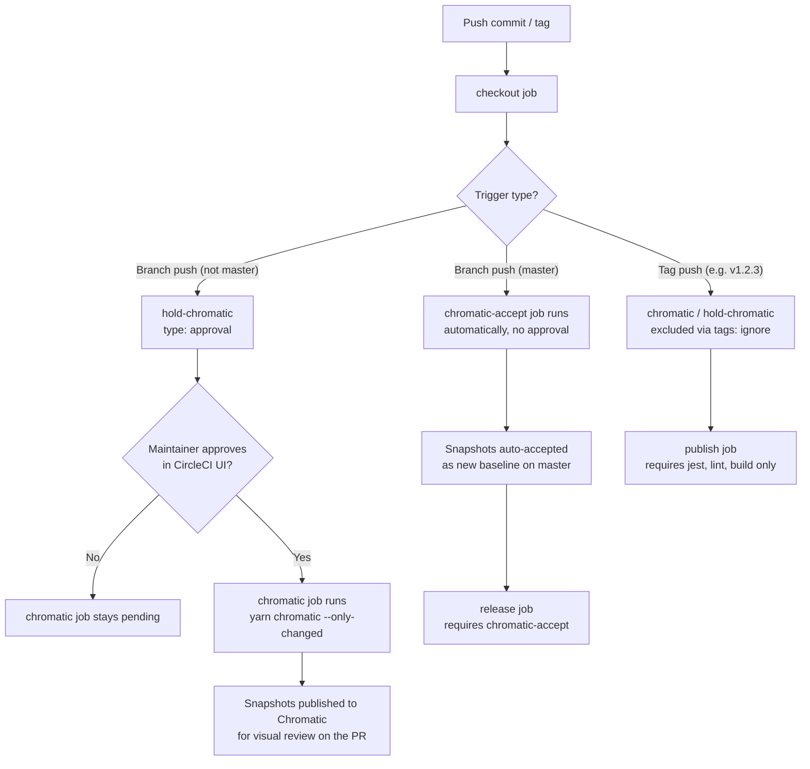

# When Chromatic runs

Chromatic (visual regression snapshots) is intentionally gated in CircleCI to control snapshot spend, since every run captures Storybook snapshots and community PR volume can otherwise trigger many full runs.

## Conditions

| Branch / event                                                 | Job                | Trigger                                     | Notes                                                                                                                                                                                                                                                     |
| -------------------------------------------------------------- | ------------------ | ------------------------------------------- | --------------------------------------------------------------------------------------------------------------------------------------------------------------------------------------------------------------------------------------------------------- |
| Any branch except `master` (includes PRs from community/forks) | `chromatic`        | Manual approval required (`hold-chromatic`) | A maintainer must click **Approve** on `hold-chromatic` in the CircleCI workflow UI. Runs with `--only-changed` (TurboSnap) to snapshot only stories affected by the diff.                                                                                |
| `master` (post-merge)                                          | `chromatic-accept` | Automatic, no approval                      | Master only contains already-reviewed/merged code, so snapshots are captured and auto-accepted as the new baseline without a manual gate.                                                                                                                 |
| Tags (e.g. release tags)                                       | —                  | Not run                                     | `hold-chromatic`/`chromatic` explicitly set `tags: ignore: /.*/`, so release tags never enter the approval gate. Release tags are cut from `master`, which was already snapshotted/accepted by `chromatic-accept`, so no further Chromatic run is needed. |

`hold-chromatic` and `chromatic` both require `checkout` to have completed and are excluded from both the `master` branch and all tags (`tags: ignore: /.*/`), since CircleCI evaluates `tags` filters independently of `branches` filters — a `branches: ignore: master` filter alone does **not** exclude tag-triggered pipelines, so the explicit `tags: ignore` is required. `release` (master-only) now requires `chromatic-accept` instead of `chromatic`, since `chromatic` never runs on `master`. `publish` (tag-only) no longer requires `chromatic` at all, since it's excluded from tag pipelines.

## Why the approval gate alone isn't sufficient

`.circleci/config.yml` is read from the commit under test, which means a PR — including one from an untrusted fork — can edit its own copy of the file to delete `hold-chromatic` or point `chromatic`'s `requires` directly at `checkout`, bypassing the approval step entirely. A workflow graph defined in untrusted YAML is not a security boundary by itself.

To close that gap, `chromatic` and `chromatic-accept` run under a restricted CircleCI **context** named `chromatic` (see `context:` in `config.yml`), and `CHROMATIC_TOKEN` lives only inside that context, not as a bare project environment variable. Context secrets are only injected when the _triggering actor_ is authorized for the context's security group — an authorization CircleCI checks independently of anything the pipeline's own YAML declares. So even if a PR's commit removes `hold-chromatic`, an unauthorized/forked-PR trigger still won't receive `$CHROMATIC_TOKEN`, and `yarn chromatic` fails to authenticate instead of spending snapshot quota. This is the actual enforcement boundary; the `hold-chromatic` approval job is a convenience/UX gate on top of it, not a replacement for it.

**Manual follow-up required (not achievable via `config.yml` alone):**

1. In the CircleCI dashboard, create a `chromatic` context restricted to a maintainers-only security group.
2. Move `CHROMATIC_TOKEN` into that context and remove it from the project's plain Environment Variables (if present there), so there's no unrestricted fallback path to the secret.
3. Confirm the project setting **"Pass secrets to builds from forked pull requests"** stays disabled, as an additional layer independent of contexts.

## Process flow

## Why this exists

- Community PRs previously triggered a full, ungated Chromatic run on every push, driving an unexpected bill increase.
- The manual approval step ensures a maintainer opts in once a PR is ready for visual review, instead of every push spending snapshot quota automatically.
- `--only-changed` (TurboSnap) further reduces the number of snapshots captured per approved run.

## Related follow-ups (not yet implemented)

- Create the `chromatic` context and migrate `CHROMATIC_TOKEN` into it (see "Why the approval gate alone isn't sufficient" above) — this is the primary outstanding action item and should be prioritized ahead of the items below.
- Enable CircleCI's **"Auto-cancel redundant workflows"** project setting so a new push cancels a stale, still-pending/running Chromatic workflow instead of accumulating multiple runs.
- Consider a GitHub PR label (e.g. `chromatic-approved`) as an alternative approval mechanism that persists across pushes, avoiding repeated manual clicks in the CircleCI UI.

### Sketch: label-based approval workflow

This would replace (or supplement) the CircleCI `hold-chromatic` approval job with a GitHub-native trigger, so maintainers approve from the PR itself instead of the CircleCI dashboard:

1. **Maintainer applies the label.** Once a PR looks ready for visual review, a maintainer adds `chromatic-approved` in the GitHub UI.
2. **A GitHub Action listens for the label event** (`pull_request: types: [labeled]`), checks that the label is exactly `chromatic-approved`, and calls the [CircleCI Trigger Pipeline API](https://circleci.com/docs/api/v2/) for the PR's branch, passing a pipeline parameter such as `run_chromatic: true`.
3. **`.circleci/config.yml` declares a pipeline parameter** (`parameters: run_chromatic: { type: boolean, default: false }`) and the `chromatic` job's `filters`/`when` condition checks that parameter instead of (or in addition to) requiring `hold-chromatic`, so it only runs when triggered with `run_chromatic: true`.
4. **Re-approval on new pushes:** since the label persists on the PR, the Action can also listen for `synchronize` events (new commits) and re-trigger automatically as long as the label is still present — removing the label (e.g. if a maintainer wants to pause runs) stops future auto-triggers without needing to touch CircleCI.
5. **Auditability:** the label change and the Action run both show up in the PR's GitHub timeline, giving a visible record of who approved Chromatic spend and when, without requiring CircleCI dashboard access.

Trade-off: this requires maintaining a small GitHub Action plus a CircleCI API token stored as a repo secret, and doubles the number of places the gating logic lives (Action + `config.yml`), versus the single native `type: approval` job used today.
