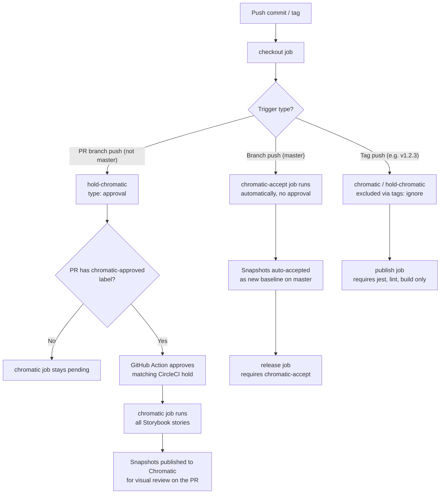

# When Chromatic runs

Chromatic (visual regression snapshots) is intentionally gated in CircleCI to control snapshot spend, since every run captures Storybook snapshots and community PR volume can otherwise trigger many full runs.

## Conditions

| Branch / event                                                 | Job                | Trigger                       | Notes                                                                                                                                                                                                                                                     |
| -------------------------------------------------------------- | ------------------ | ----------------------------- | --------------------------------------------------------------------------------------------------------------------------------------------------------------------------------------------------------------------------------------------------------- |
| Any branch except `master` (includes PRs from community/forks) | `chromatic`        | `chromatic-approved` PR label | A maintainer applies the label in GitHub. Each labeled PR commit runs the full Storybook snapshot suite after the matching CircleCI `hold-chromatic` job is approved.                                                                                     |
| `master` (post-merge)                                          | `chromatic-accept` | Automatic, no approval        | Master only contains already-reviewed/merged code, so snapshots are captured and auto-accepted as the new baseline without a manual gate.                                                                                                                 |
| Tags (e.g. release tags)                                       | —                  | Not run                       | `hold-chromatic`/`chromatic` explicitly set `tags: ignore: /.*/`, so release tags never enter the approval gate. Release tags are cut from `master`, which was already snapshotted/accepted by `chromatic-accept`, so no further Chromatic run is needed. |

`hold-chromatic` and `chromatic` both require `checkout` to have completed and are excluded from both the `master` branch and all tags (`tags: ignore: /.*/`), since CircleCI evaluates `tags` filters independently of `branches` filters — a `branches: ignore: master` filter alone does **not** exclude tag-triggered pipelines, so the explicit `tags: ignore` is required. `release` (master-only) now requires `chromatic-accept` instead of `chromatic`, since `chromatic` never runs on `master`. `publish` (tag-only) no longer requires `chromatic` at all, since it's excluded from tag pipelines.

## Why the approval gate alone isn't sufficient

`.circleci/config.yml` is read from the commit under test, which means a PR — including one from an untrusted fork — can edit its own copy of the file to delete `hold-chromatic` or point `chromatic`'s `requires` directly at `checkout`, bypassing the approval step entirely. A workflow graph defined in untrusted YAML is not a security boundary by itself.

To close that gap, `chromatic` and `chromatic-accept` run under a restricted CircleCI **context** named `chromatic` (see `context:` in `config.yml`), and `CHROMATIC_TOKEN` lives only inside that context, not as a bare project environment variable. Context secrets are only injected when the _triggering actor_ is authorized for the context's security group — an authorization CircleCI checks independently of anything the pipeline's own YAML declares. So even if a PR's commit removes `hold-chromatic`, an unauthorized/forked-PR trigger still won't receive `$CHROMATIC_TOKEN`, and `yarn chromatic` fails to authenticate instead of spending snapshot quota. This is the actual enforcement boundary; the `hold-chromatic` approval job is a convenience/UX gate on top of it, not a replacement for it.

**Manual follow-up required (not achievable via `config.yml` alone):**

1. In the CircleCI dashboard, create a `chromatic` context restricted to a maintainers-only security group.
2. Move `CHROMATIC_TOKEN` into that context and remove it from the project's plain Environment Variables (if present there), so there's no unrestricted fallback path to the secret.
3. Confirm the project setting **"Pass secrets to builds from forked pull requests"** stays disabled, as an additional layer independent of contexts.

## Process flow

## Why this exists

- Community PRs previously triggered a full, ungated Chromatic run on every push, driving an unexpected bill increase.
- The `chromatic-approved` label lets a maintainer approve from the PR. The label persists, so later commits automatically run Chromatic until the label is removed.
- Each approved run snapshots all stories. This deliberately trades higher snapshot spend for complete visual coverage.

## Using the label

1. A maintainer adds `chromatic-approved` to an open PR. GitHub Actions verifies that the labeler has `write`, `maintain`, or `admin` repository access, then approves only the CircleCI `hold-chromatic` job for that PR's exact head SHA.
2. Keep the label applied to approve the next `synchronize` event automatically when the author pushes another commit.
3. Remove the label to pause automatic runs. To rerun Chromatic for an unchanged commit, remove and re-add the label.

The Action uses `pull_request_target` only to access its credentials from the trusted default branch. It never checks out or runs pull-request code. It requires a repository or organization `CIRCLECI_TOKEN` secret with permission to read project pipelines and approve jobs.

## Remaining setup

1. Create the `chromatic-approved` repository label.
2. Add `CIRCLECI_TOKEN` as a GitHub Actions secret. Use a dedicated least-privilege token, rather than `CHROMATIC_TOKEN`.
3. Create the `chromatic` CircleCI context, restrict it to maintainers, move `CHROMATIC_TOKEN` into it, and remove any plain project-level fallback.
4. Keep CircleCI's **"Pass secrets to builds from forked pull requests"** setting disabled. Verify a fork PR end to end: CircleCI context policy, rather than this Action, decides whether its `chromatic` job can access `CHROMATIC_TOKEN`.
5. Enable CircleCI's **"Auto-cancel redundant workflows"** project setting so a new push cancels stale pending or running Chromatic work.

The Action deliberately approves the workflow CircleCI already created instead of triggering a second pipeline. This avoids duplicating the rest of CI and preserves the restricted CircleCI context as the boundary that protects `CHROMATIC_TOKEN`.
