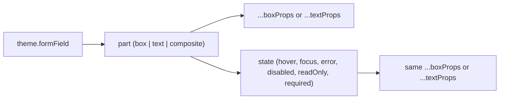
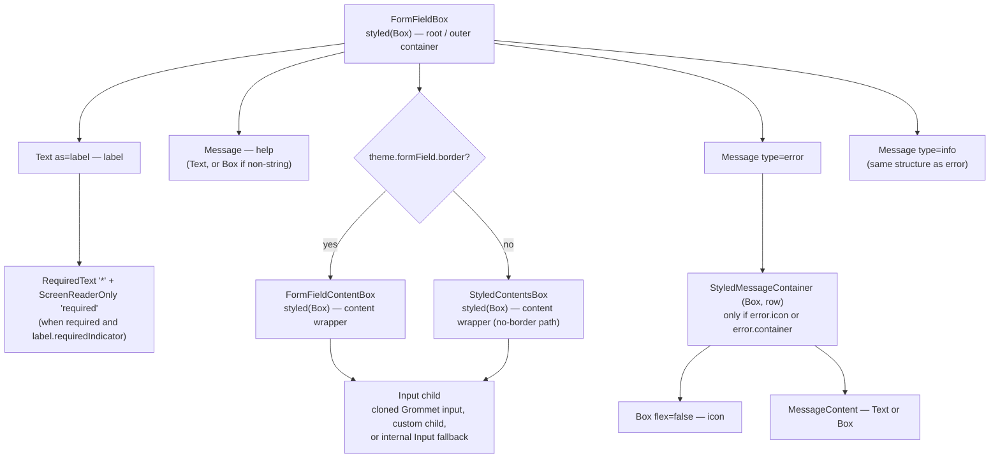
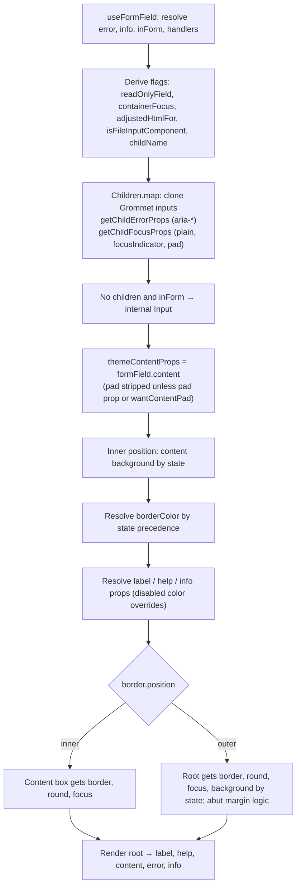
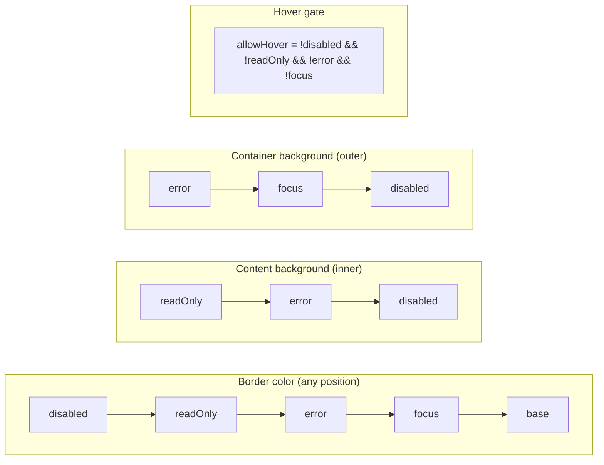
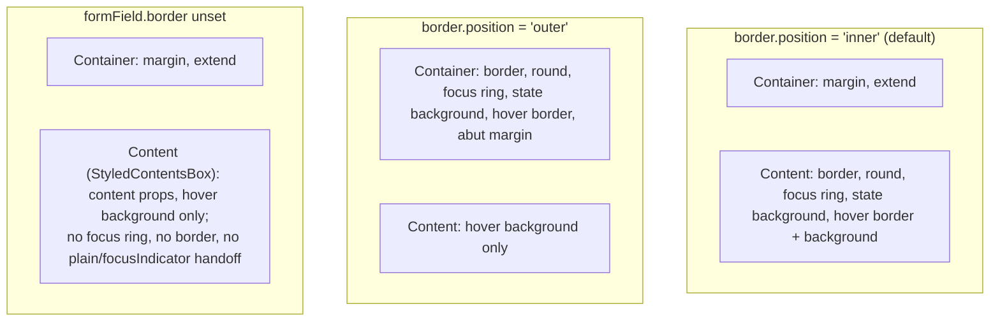
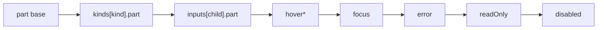
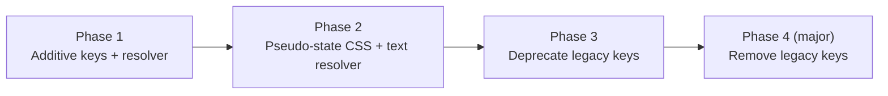

# FormField: Anatomy, Theming Model, and Path to a Part/State Theme Architecture

This document has four goals:

1. Describe how `FormField` is assembled today and what its anatomical parts are.
2. Map every `theme.formField` token to the part it actually styles.
3. Critically assess a proposed "parts → states → props" theming architecture.
4. Assess the gap between today and that architecture, and the feasibility of closing it.

Source references point at [FormField.js](./FormField.js), [base.js](../../themes/base.js) and [base.d.ts](../../themes/base.d.ts).

---

## 1. The desired architecture (reference model)

The model being evaluated:

- A component is a composition of **anatomical parts**.
- Each part has a **kind** that determines its styling vocabulary:
  - **Box parts** accept `...boxProps` (background, border, pad, margin, round, elevation, …).
  - **Text parts** accept `...textProps` (color, size, weight, line height, max width, font family, …).
  - **Composite parts** (a box wrapping text) expose both, e.g. `container` (box) + `text` (text).
- **States** (interactive: hover, focus; application: error, disabled, readOnly, required) are nested **under the part they affect**, and accept the **same vocabulary as the part**.



---

## 2. Current anatomy

### 2.1 Rendered tree

`FormField` renders one root `Box` and up to five children. Which element wraps the input, and which element owns the border, depends on the theme (`formField.border` present? `border.position` inner or outer?).



### 2.2 Parts inventory

| Part | Element | Kind | Notes |
|---|---|---|---|
| Container (root) | `FormFieldBox` | box | Receives `...rest`, focus/blur/change handlers. Owns border when `position: 'outer'`. |
| Label | `Text as="label"` | text | Hidden when `component === CheckBox` (CheckBox renders its own label). |
| Required indicator | `RequiredText` + `ScreenReaderOnly` | text | Inherits label color/weight/line height; only content is configurable (`label.requiredIndicator`). |
| Help | `Message` → `Text` / `Box` | text | Rendered directly after the label, before the content. |
| Content | `FormFieldContentBox` / `StyledContentsBox` | box | Owns border when `position: 'inner'` (default). Background for states lives here (inner). |
| Input | child | external | Styled by its own theme; FormField sets `plain`, `focusIndicator`, `pad` on Grommet inputs. |
| Error message | `Message type="error"` | composite | Optional container (box) + icon + text. |
| Info message | `Message type="info"` | composite | Same as error. |

### 2.3 Assembly flow



Key code locations:

- Focus styling: [`getFocusStyle`](./FormField.js#L81)
- Hover styling: [`getHoverStyle`](./FormField.js#L97)
- Styled parts: [`FormFieldBox`](./FormField.js#L139), [`FormFieldContentBox`](./FormField.js#L145), [`StyledContentsBox`](./FormField.js#L165), [`StyledMessageContainer`](./FormField.js#L172)
- Child prop handoff: [`getChildFocusProps`](./FormField.js#L296)
- Content props and inner background: [FormField.js](./FormField.js#L509)
- Border color precedence: [FormField.js](./FormField.js#L570)
- Label/help/info props: [FormField.js](./FormField.js#L607)
- Border placement (inner): [FormField.js](./FormField.js#L638)
- Outer background: [FormField.js](./FormField.js#L709)

---

## 3. Theme-to-anatomy map

Defaults live in [base.js](../../themes/base.js#L1289); types in [base.d.ts](../../themes/base.d.ts) (`formField`).

Legend for **Shape**: `box` = Box props, `text` = Text props, `color` = single color, `flag` = behavior switch, `css` = `extend`, `node` = React node.

### 3.1 Structural / base tokens

| Token | Part actually styled | Shape | Notes |
|---|---|---|---|
| `border.color` | content (inner) **or** container (outer) | color | Target part depends on `border.position`. |
| `border.position` | — | flag | Decides which part owns border, round, focus ring and state background. |
| `border.side`, `size`, `style` | content or container | box (partial) | Inner forces `side` to `'bottom'` if unset; FileInput replaces size/style/side with `fileInput.border`. |
| `border.error.color` | content or container | color | Legacy location for error border; superseded by `error.border.color`. |
| `round` | content or container | box | Follows the border owner. |
| `margin` | container | box | Overridden by the abut logic for outer, all-sided borders. |
| `extend` | container | css | |
| `content` | content | box (de facto any Box prop) | Typed as `{ margin, pad }`, but the whole object is spread onto the content Box. `pad` is stripped unless the `pad` prop is set or the child is a pad-wanting input. |
| `label` | label | text + node | `FormFieldLabelType extends TextProps`, plus `requiredIndicator`. |
| `help` | help | text | Spread onto `Message` → `Text`. |
| `info` | info message | composite | `container` (box), `icon` (node), rest spread as text props. |
| `error` | error message **and** field error state | composite + state | See 3.2 — this key is overloaded. |

### 3.2 State tokens

| Token | Part actually styled | Shape | Notes |
|---|---|---|---|
| `hover.background` | content | background | Applied via `&:hover` CSS. Never applied to the container, even with an outer border. |
| `hover.border.color` | border owner | color | Applied via `&:hover` CSS. |
| `focus.border.color` | border owner | color | |
| `focus.background.color` | container (outer only) | color | No effect with an inner border. |
| `focus.containerFocus` | content or container | flag | Whether the focus ring is drawn on the FormField or on the input. |
| `error.background` | content (inner) or container (outer) | background | |
| `error.border.color` | border owner | color | |
| `error.color`, `error.margin` | error message | text | Same object as the state tokens above. |
| `error.container`, `error.icon` | error message | box, node | |
| `disabled.background` | content (inner) or container (outer) | background | |
| `disabled.border.color` | border owner | color | |
| `disabled.label.color` | label | color | State → part (inverted nesting). |
| `disabled.help.color` | help | color | State → part. |
| `disabled.info.color` | info message | color | State → part. |

### 3.3 Variant tokens

| Token | Part actually styled | Shape | Notes |
|---|---|---|---|
| `[inputName].container.extend` | content | css | e.g. `formField.textInput.container.extend`. |
| `[inputName].hover.background` / `.border.color` | content / border owner | background, color | Overrides global `hover`. |
| `checkBox.pad` | input (CheckBox) | box (pad) | Passed as a prop to the child, not to a FormField part. |
| `survey.label` (form `kind`) | label | text | Replaces `label` entirely when `<Form kind="survey">`. |

### 3.4 Tokens consumed from outside `formField`

| Token | Part | Notes |
|---|---|---|
| `global.input.readOnly.background` | content (inner only) | readOnly has no `formField` namespace. |
| `global.input.readOnly.border.color` | border owner | |
| `global.focus.*` (via `focusStyle`) | border owner | Focus ring appearance is global, not part of `formField`. |
| `fileInput.border.size/style/side` | content | When the child is a FileInput. |
| `global.borderSize` | container | Used to compute the negative abut margin. |

### 3.5 Observations

1. **Part targeting is implicit.** `border`, `round`, background states and focus all move between container and content based on `border.position`. A token name does not tell you which part it styles.
2. **`error` is both a part and a state.** `error.color` / `error.margin` / `error.container` / `error.icon` style the message part; `error.background` / `error.border` style the field in its error state. Because the whole `formField.error` object is spread onto `Message`, the state tokens (`background`, `border`) and `container` / `icon` are also passed as props to the message `Text`/`Box`.
3. **Nesting direction is mixed.** Most tokens are part → property, but `disabled.*` is state → part → property (`disabled.label.color`), the opposite of the desired model.
4. **State vocabulary is narrow.** States accept a color or a background only. You cannot, for example, change border width on focus, pad on error or label weight on disabled.
5. **Some states are missing.** There is no readOnly namespace in `formField`, no `required` state beyond the indicator node, no hover/focus for label/help/messages, and no state for the container in inner mode.
6. **Two sources for one thing.** Error border color can come from `border.error.color` or `error.border.color`, with a compatibility branch choosing between them.
7. **Declared types and runtime behavior differ.** `content` is typed as `{ margin, pad }` but accepts any Box prop; `focus.background` is typed as a `BackgroundType` but only `.color` is read.

---

## 4. State resolution today

### 4.1 Precedence

States are resolved by three independent `if / else if` chains plus a hover gate, and **the orderings differ**.



Consequences:

- A **disabled field with an error** shows the disabled border but the error background with an inner border (readOnly > error > disabled), and the error background with an outer border.
- A **focused field** gets a focus background only with an outer border.
- **States do not combine.** The first matching branch wins; for example, an error field that is focused cannot have error and focus treatments layered together (except the global focus ring, which is applied separately).

### 4.2 Which part owns what, by position



---

## 5. Boundary between FormField and child inputs

FormField takes over some of the styling a child input would normally do itself. That handoff affects where any part/state model can apply.

| Mechanism | Effect | Location |
|---|---|---|
| `plain: true` | Child drops its own border/background so FormField's border owner is the only visible frame. | `getChildFocusProps` |
| `focusIndicator: !containerFocus` | Either FormField or the child draws the focus ring, never both. | `getChildFocusProps` |
| `containerFocus` | `false` when the child is in `grommetInputFocusNames` (CheckBox, RadioButtonGroup, RangeInput, …) unless `focus.containerFocus === true`. | `containerFocus` memo |
| `pad` on CheckBox | From `formField.checkBox.pad`. | `getChildFocusProps` |
| `wantContentPad` | Keeps `content.pad` for CheckBox, CheckBoxGroup, RadioButtonGroup, RangeInput and RangeSelector. | contents map |
| FileInput | Borrows `fileInput.border.*` and suppresses FormField focus. | `innerProps` |
| TimeInput | Adds a `:focus-within` ring on content. | `FormFieldContentBox` |
| readOnly detection | Only for `TextInput` / `DateInput` children with `readOnly` or `readOnlyCopy`. | `readOnlyField` memo |
| Handoff conditions | Only when `formField.border` is set and the consumer didn't set `plain`/`focusIndicator`. | `getChildFocusProps` |

Implications for the target model:

- The **input** part is not a FormField-styled part: its look comes from the child's own theme. FormField can only style the **content** box around it.
- Focus ownership is a **behavior** decision (`containerFocus`), not a style. It should stay a flag and not become a box prop.
- Per-input variants (`formField.textInput.*`) already exist; a new model should keep that concept and make its shape consistent.

---

## 6. Critical assessment of the desired architecture

### 6.1 Strengths

| Strength | Why it matters here |
|---|---|
| **Predictability** | Token path = part → state → prop. A theme author can tell from the key alone what will change. Today `border`, `round` and backgrounds move between parts based on `position`. |
| **One vocabulary** | Authors already know Box and Text props. Reusing them removes per-component mini-languages (`hover.border.color` vs `disabled.label.color` vs `focus.background.color`). |
| **Removes hidden coupling** | If both container and content accept full box props, `border.position` becomes unnecessary: put the border on the part you want. |
| **Expressiveness** | States accept everything the part accepts: border width on focus, pad on error, weight on a disabled label. |
| **Combinable states** | With a defined merge order, error + focus can layer instead of first-match-wins. |
| **Type reuse** | `BoxProps` / `TextProps` are already used inside theme types (`card.container`, `notification.container`, `formField.error.container`, `formField.label`). |
| **Generalizable** | The same model applies to any component; once there's a resolver, it can be reused. |
| **Fixes the `error` overload** | Separating the message part from the error state follows naturally. |

### 6.2 Weaknesses and risks

| Risk | Detail | Mitigation |
|---|---|---|
| **Pseudo-class states can't be expressed as props** | Hover (and `:focus-within`) happen in CSS, not React state. Box props are turned into CSS inside `StyledBox`; there's no public way to say "these Box props, but under `&:hover`". | A props-to-CSS translator built from existing helpers (`backgroundStyle`, `borderStyle`, `edgeStyle`, `roundStyle`) scoped to a selector. Alternatively track hover in React state, which costs re-renders and doesn't help touch devices. |
| **Unrestricted props can break the component** | Full `BoxProps` include `direction`, `fill`, `flex`, `as`, `onClick`, `a11yTitle`, `responsive`, `gap`, `wrap`. On the container, `direction: 'row'` would rearrange label/content/messages. | Publish an allowlist of style props per part (see 8.2). |
| **Text props don't cover the full text vocabulary** | Grommet `Text` exposes `color`, `size`, `weight`, `margin`, `textAlign`, `truncate`, `wordBreak`, but **not** `family`, `lineHeight` or `maxWidth` as separate props; `size` resolves all three from `theme.text[size]`. | Either add a theme-only text-style resolver for `family` / `lineHeight` / `maxWidth` / `letterSpacing`, or add those props to Text (broader impact). |
| **Composite parts need two keys** | Messages are box + icon + text. Non-string messages render in a `Box`, not `Text`, so text props must still apply (as inherited CSS). | `messages.error = { container, icon, text }`. Apply text props as CSS on the content wrapper whether it renders as Text or Box. |
| **States need a single precedence order** | Layered states need one documented order and merge semantics (shallow vs deep for `border` / `background` objects; arrays for multi-side borders). | Ascending merge: base → kind → input variant → hover → focus → error → readOnly → disabled. Deep-merge objects, replace arrays. |
| **Focus ring is not a box border** | `focusStyle` draws an outline or box-shadow from `global.focus`. A border color on `focus` won't replace the ring. | Keep `focus.ring` (or reuse `containerFocus`) separate from box props; document that box props in `focus` layer on top. |
| **Performance** | Merging nested theme objects on every render for 5+ parts × N states. | Memoize per (theme, state flags, variant). States are booleans, so the cache is small. |
| **Type surface** | `BoxProps` / `TextProps` nested under every part and state produce very large types. | Use mapped helper types (`PartTheme<P> = P & { [S in States]?: P }`) rather than spelling them out. |
| **Responsive / dark-light values** | Box props accept responsive and `{ dark, light }` values; any CSS translator must keep that. | Reuse the existing helpers, which already handle these. |
| **Generality may hide intent** | Pure prop bags lose some meaning ("this is the indicator color"). | Keep a small set of named non-style tokens (`requiredIndicator`, `icon`, `containerFocus`). |

### 6.3 Verdict

The model is sound and fits the codebase's direction (Box/Text props already appear in themes). The main costs are (1) building a reusable "props under a selector" translator for hover-like states, (2) an allowlist per part, and (3) extending the Text vocabulary. None blocks adoption; all three are reusable beyond FormField.

---

## 7. Gap analysis: current vs. desired

Legend: ✅ supported in the desired shape · 🟡 partial (some properties or wrong nesting) · ⚠️ supported but in the wrong place or implicit · ❌ missing.

| Part \ State | base | hover | focus | error | disabled | readOnly | required |
|---|---|---|---|---|---|---|---|
| **Container** (box) | 🟡 `margin`, `extend`; border/round only if outer | 🟡 border color only, outer only | 🟡 border color + bg color, outer only | 🟡 bg + border color, outer only | 🟡 bg + border color, outer only | ⚠️ `global.input.readOnly.border.color`, outer only | ❌ |
| **Label** (text) | ✅ `label` (TextProps) | ❌ | ❌ | ❌ | ⚠️ `disabled.label.color` | ❌ | 🟡 `label.requiredIndicator` (node only) |
| **Required indicator** (text) | 🟡 node only; styles inherited | ❌ | ❌ | ❌ | ❌ | ❌ | — |
| **Help** (text) | ✅ `help` | ❌ | ❌ | ❌ | ⚠️ `disabled.help.color` | ❌ | ❌ |
| **Content** (box) | 🟡 `content` (any Box prop at runtime, typed as margin/pad; pad gated); border/round only if inner | 🟡 bg + border color | 🟡 border color; ring via global | 🟡 bg + border color | 🟡 bg + border color | ⚠️ `global.input.readOnly.*` | ❌ |
| **Error message** (composite) | ⚠️ `error.*` shared with error state | ❌ | ❌ | — | ❌ | ❌ | — |
| **Info message** (composite) | 🟡 `info` text + `container` + `icon` | ❌ | ❌ | ❌ | ⚠️ `disabled.info.color` | ❌ | — |

Cross-cutting gaps:

| Concern | Current | Desired |
|---|---|---|
| Part targeting | Implicit through `border.position` | Explicit by key |
| Nesting direction | Mixed (part → state and state → part) | Always part → state |
| State vocabulary | Color/background only | Full box or text props |
| State combination | First-match, three different orders | One documented order, layered |
| Input variants | `[inputName].container.extend`, `[inputName].hover` | Same part tree, deep-merged |
| Form kind variants | `survey.label` replaces `label` | Same part tree, deep-merged |
| Extension points | `extend` on container, input content containers and message containers | `extend` on every part and state |

---

## 8. Proposed theme shape

### 8.1 Shape

Parts at the top level. States nested inside each part, using the part's vocabulary. Variants (`kinds`, `inputs`) repeat the same tree as partial overrides. Messages move under `messages` to free `error` for use as a state name.

```js
formField: {
  container: {
    // allowlisted ...boxProps
    margin: { bottom: 'small' },
    hover: {}, focus: {}, error: {}, disabled: {}, readOnly: {},
  },
  label: {
    // ...textProps (+ family, lineHeight, maxWidth via text resolver)
    margin: { vertical: 'xsmall', horizontal: 'small' },
    disabled: { color: 'text-weak' },
    error: {}, focus: {}, hover: {}, readOnly: {},
    required: { indicator: true },
  },
  help: {
    color: 'dark-2',
    margin: { start: 'small' },
    disabled: {},
  },
  content: {
    // allowlisted ...boxProps
    pad: 'small',
    border: { side: 'bottom', color: 'border' },
    hover: { border: { color: 'border-strong' } },
    focus: {},
    error: { border: { color: 'status-critical' } },
    disabled: { background: { color: 'status-disabled', opacity: 'medium' } },
    readOnly: {},
    containerFocus: true, // behavior flag, not a style
  },
  messages: {
    error: {
      container: { /* ...boxProps */ },
      icon: undefined,
      text: { color: 'status-critical', margin: { vertical: 'xsmall', horizontal: 'small' } },
    },
    info: {
      container: {},
      icon: undefined,
      text: { color: 'text-xweak', margin: { vertical: 'xsmall', horizontal: 'small' } },
      disabled: { text: {} },
    },
  },
  kinds: {
    survey: { label: { /* partial label tree */ } },
  },
  inputs: {
    textInput: { content: { extend: undefined, hover: {} } },
    checkBox: { content: { pad: undefined } },
  },
},
```

### 8.2 Allowlists

| Part kind | Allowed props |
|---|---|
| Box | `background`, `border`, `round`, `pad`, `margin`, `elevation`, `width`, `height`, `gap`, `extend` |
| Text | `color`, `size`, `weight`, `margin`, `textAlign`, `wordBreak`, `truncate`, `extend`, plus resolver-backed `family`, `lineHeight`, `maxWidth`, `letterSpacing` |
| Excluded everywhere | `direction`, `fill`, `flex`, `basis`, `wrap`, `as`, `responsive`, event handlers, `a11yTitle`, `id` |

### 8.3 Resolution

For each part, the resolved props are a deep merge in ascending priority:



\* Hover is not merged as props. It is emitted as `&:hover { … }` CSS from the merged hover props, and only when no higher state is active (preserves today's `allowHover` behavior).

---

## 9. Feasibility and migration

### 9.1 Building blocks that already exist

| Need | Existing asset |
|---|---|
| Box props → CSS | `backgroundStyle` ([background.js](../../utils/background.js)), `borderStyle` ([border.js](../../utils/border.js)), `edgeStyle`, `roundStyle`, `focusStyle` ([styles.js](../../utils/styles.js)) |
| Disabled / readOnly helpers | `disabledStyle`, `readOnlyStyle` |
| Box/Text props in theme types | `BoxProps`, `TextProps` imported in `base.d.ts` |
| Variant-per-input pattern | `childName` camel-casing and `formField[childName]` lookups |

### 9.2 Phased plan



| Phase | Scope | Effort | Risk |
|---|---|---|---|
| **1. Additive keys + resolver** | Add `container`, `content` (typed), `label`/`help` states, `messages`, `kinds`, `inputs`. Write a `resolveFormFieldTheme(theme, { disabled, readOnly, error, focus, kind, childName })` that first maps legacy tokens into the new shape, then deep-merges new tokens on top. Apply resolved props to existing parts. Keep `border.position` as a fallback that seeds `container.border` or `content.border`. | Medium | Low. Purely additive; legacy themes resolve the same. Snapshot tests catch regressions. |
| **2. Pseudo-state CSS + text resolver** | A shared `stylePropsToCss(props, theme)` built on the existing helpers, used for `&:hover` (and `:focus-within` for TimeInput). A text-style resolver for `family`, `lineHeight`, `maxWidth`, `letterSpacing`. Apply text props to message content even when it renders as `Box`. | Medium–High | Medium. Must match `StyledBox` output for responsive and dark/light values. |
| **3. Deprecate legacy keys** | Dev-only console warnings for `border.position`, `border.error.color`, `disabled.{label,help,info}`, `error.{color,margin,container,icon}` as message styling, `[inputName].*` at top level, `survey.*` at top level, and `global.input.readOnly` for FormField. Update `base.js` defaults to the new shape (with the legacy mapping still active). Update `base.d.ts`. | Low–Medium | Medium. Downstream themes (e.g. HPE) will see warnings; they need a migration guide and possibly a codemod. |
| **4. Remove legacy keys (major)** | Delete the legacy mapping, the `position` branches and the error-border compatibility branch. | Low | High for consumers, low for code. |

### 9.3 Testing and documentation needed

- **Unit tests:** one per part × state with a custom theme (role/label queries, `toHaveStyleRule`), plus combinations (error + focus, disabled + error).
- **Legacy parity tests:** render with `base` and with a legacy-shaped custom theme, and confirm the computed styles are unchanged.
- **Stories:** a `CustomThemed/PartsAndStates.stories.tsx` story showing each part and state; keep the existing `Custom.stories.tsx` as a legacy reference.
- **Docs:** a migration table (legacy key → new key).

### 9.4 Backward compatibility

Every legacy token maps cleanly onto a part/state path, so Phases 1–3 can be non-breaking. The behavior changes that need explicit decisions are:

1. **Precedence unification.** Today's three orders can't all be kept. Choosing one (8.3) changes the visible result for disabled + error and readOnly + error combinations in some position modes.
2. **State layering.** Moving from first-match to layered merging changes results only when a theme sets tokens for several active states at once.
3. **`formField.error` spread.** Stopping the spread of state tokens onto the error message `Text` is a fix, but anyone relying on the leak (e.g. `error.background` tinting the message) would see a change.

### 9.5 Overall feasibility

**Feasible, incremental, and reusable.** The largest single investment, the selector-scoped props-to-CSS translator, is generic and would benefit other components (Select, TextInput, Tabs) that have similar hover/focus/state tokens. FormField is a good pilot: its anatomy is small, its tokens are already partly Box/Text shaped, and its inconsistencies (position coupling, `error` overload, mixed nesting, three precedence orders) are exactly what the model removes.

---

## 10. Open questions

1. Should `border.position` survive as a convenience preset, or be fully replaced by explicit `container.border` / `content.border`?
2. Should the content part's state treatments also apply when there is no `formField.border` (today the no-border path only supports hover background)?
3. Should `required` be a real state (e.g. `label.required.weight`), or only the indicator?
4. Should hover be suppressed by every higher state (current behavior) or layered with them?
5. Is extending `Text` with `family` / `lineHeight` / `maxWidth` props in scope, or should those remain theme-only?
6. Should `inputs.*` be able to override non-FormField parts of the child input, or stay limited to FormField's own parts?
7. Is a codemod for downstream themes needed, or is a migration table enough?
