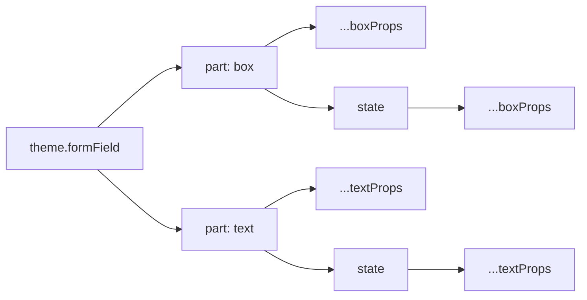
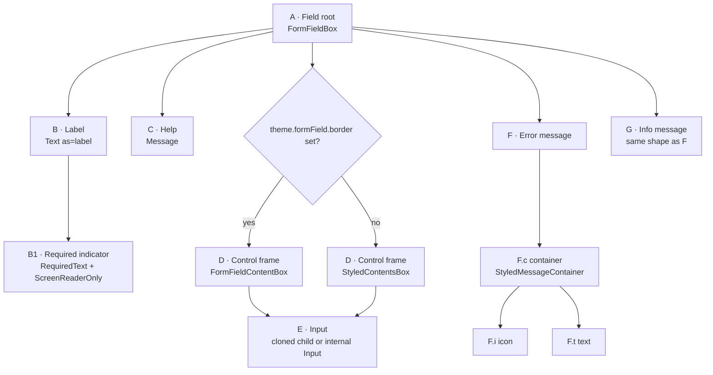
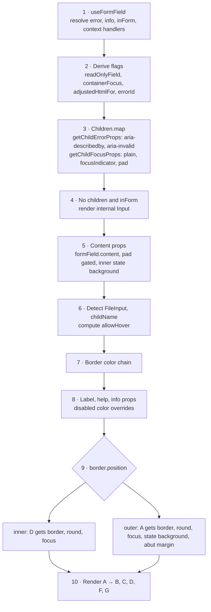
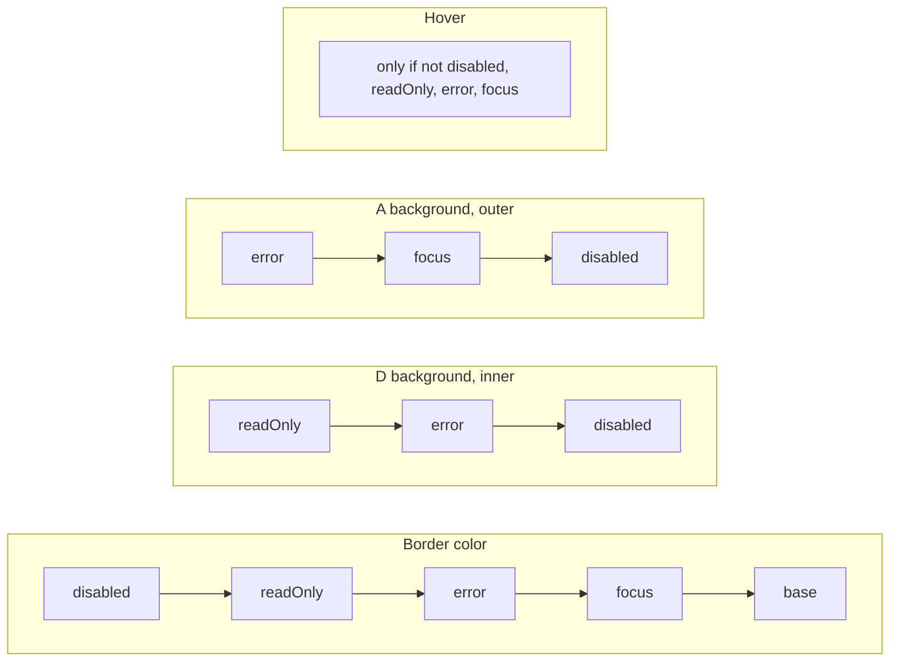
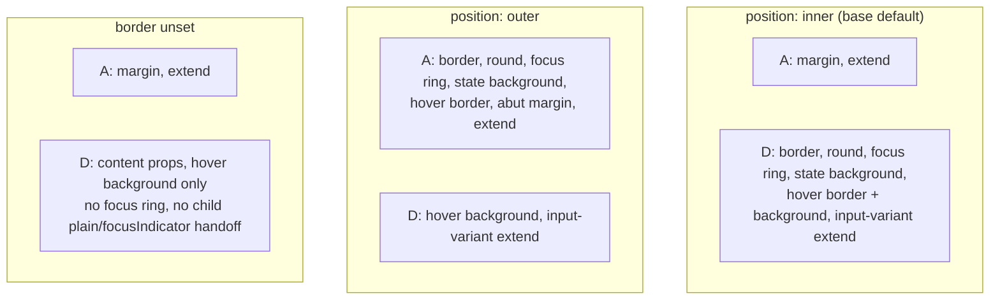
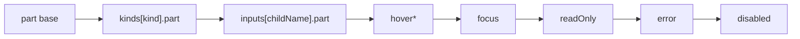
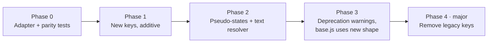

# FormField Theming, Take B: Anatomy, Token Audit, and a Part → State → Props Model

This document looks at `FormField` through a single lens: **a component is a set of composed boxes (and text runs), each one an anatomical part that should be styled with the props it already understands.**

It answers four questions:

1. How is `FormField` assembled today, and what are its parts? (§1–§3)
2. How well does `theme.formField` map onto those parts? (§4)
3. How strong is the proposed part → state → props model? (§5)
4. How far is today from that model, and how feasible is it to close the gap? (§6–§8)

Sources: [FormField.js](./FormField.js), [base.js](../../themes/base.js#L1289), [base.d.ts](../../themes/base.d.ts), [Text/index.d.ts](../Text/index.d.ts), and `grommet-theme-hpe@8.2.0` (`node_modules/grommet-theme-hpe/dist/es6/themes/form.js`), which is the largest real-world consumer of these tokens.

---

## 0. The target model in one picture

Goals, numbered so the rest of the document can refer to them:

| # | Goal |
|---|---|
| **G1** | A theme key names the anatomical part it targets. |
| **G2** | States (interactive and application) are children of the part they modify. |
| **G3** | Box parts accept `...boxProps`; their states accept the same `...boxProps`. |
| **G4** | Text parts accept `...textProps` (size, weight, line height, max width, family, color, …); their states accept the same. |
| **G5** | The result is predictable, flexible, and extensible, and simpler to implement. |



---

## 1. Anatomy

### 1.1 Parts

Each part gets a short ID used throughout the document.

| ID | Part | Rendered by | Kind | Always present? |
|---|---|---|---|---|
| **A** | Field (root) | `FormFieldBox` = `styled(Box)` | box | yes |
| **B** | Label | `Text as="label"` | text | when `label` is set and `component !== CheckBox` |
| **B1** | Required indicator | `RequiredText` (`*`, `aria-hidden`) + `ScreenReaderOnly` (`"required"`) | text | when `required` and `label.requiredIndicator` |
| **C** | Help | `Message` → `Text` (string) or `Box` (node) | text | when `help` is set |
| **D** | Control frame | `FormFieldContentBox` (theme has `border`) or `StyledContentsBox` (no `border`) | box | yes |
| **E** | Input | child element, or internal `Input` (defaults to `TextInput`) | external | yes, when in a `Form` or children are given |
| **F** | Error message | `Message type="error"` | composite | when there's an error |
| F.c | └ container | `StyledMessageContainer` (row `Box`) | box | only when `error.icon` or `error.container` is themed |
| F.i | └ icon | `Box flex={false}` | box/node | only when `error.icon` is themed |
| F.t | └ text | `MessageContent` → `Text` or `Box` | text | yes |
| **G** | Info message | `Message type="info"` (same structure as F) | composite | when `info` is set |

### 1.2 Rendered tree



DOM order is always label, help, control frame, error, info. Help sits **above** the control and error/info sit **below** it. Theme authors can't reorder these.

### 1.3 Assembly pipeline



Code anchors:

| Step | Location |
|---|---|
| Focus CSS | [`getFocusStyle`](./FormField.js#L81) |
| Hover CSS (role-aware) | [`getHoverStyle`](./FormField.js#L97) |
| Styled parts | [`FormFieldBox`](./FormField.js#L139), [`FormFieldContentBox`](./FormField.js#L145), [`StyledContentsBox`](./FormField.js#L165), [`StyledMessageContainer`](./FormField.js#L172) |
| Message rendering | [`Message`](./FormField.js#L207) |
| Child prop injection | [`getChildErrorProps`](./FormField.js#L278), [`getChildFocusProps`](./FormField.js#L296) |
| readOnly / containerFocus detection | [`readOnlyField`](./FormField.js#L377), [`containerFocus`](./FormField.js#L395) |
| Content props + inner background | [`themeContentProps`](./FormField.js#L509) |
| Hover gate | [`allowHover`](./FormField.js#L553) |
| Border color chain | [`borderColor`](./FormField.js#L570) |
| Label / help / info props | [`labelStyle`](./FormField.js#L607) |
| Border placement | [`if (themeBorder)`](./FormField.js#L637) |
| Outer background chain | [`outerBackground`](./FormField.js#L709) |
| Required indicator | [`requiredIndicator`](./FormField.js#L739) |

---

## 2. States

### 2.1 Where each state comes from

| State | Source | Scope |
|---|---|---|
| `hover` | CSS `:hover`, gated by `allowHover` | D (and A when outer) |
| `focus` | React state set in the root `onFocus`/`onBlur` | A or D |
| `focus-within` | CSS, TimeInput only | D |
| `error` | `error` prop or Form validation | whole field |
| `disabled` | `disabled` prop | whole field |
| `readOnly` | **inferred**: a `TextInput`/`DateInput` child with `readOnly` or `readOnlyCopy` | whole field |
| `required` | `required` prop | label only (indicator) |
| `kind` (variant) | `Form kind` (e.g. `survey`) | label only |
| input variant | `childName` (camel-cased child `displayName`) | D only |

### 2.2 How states resolve

Each visual property resolves states **independently, first match wins**, and the orderings disagree:



Example: a field that is **disabled and in error**, with the default inner border, gets the *disabled* border color and the *error* background.

### 2.3 Who owns what, by `border.position`



Which part receives `border`, `round`, focus and state backgrounds depends on **one flag**. That is the main reason today's tokens don't satisfy **G1**.

---

## 3. The FormField ↔ Input boundary

The input (part E) is styled by its own theme. FormField changes the input's look only through props injected at clone time:

| Mechanism | Effect | Applies when |
|---|---|---|
| `plain: true` | Input drops its own border/background so D or A is the only visible frame | `formField.border` set, consumer didn't set `plain`/`focusIndicator` |
| `focusIndicator: !containerFocus` | Exactly one of FormField or the input draws a focus ring | same |
| `containerFocus` | `false` for CheckBox, CheckBoxGroup, RadioButton(Group), RangeInput, RangeSelector, StarRating, ThumbsRating unless `focus.containerFocus === true` | always |
| `pad` | `formField.checkBox.pad` → CheckBox child | CheckBox child |
| `wantContentPad` | Keeps `content.pad` | CheckBox / CheckBoxGroup / RadioButtonGroup / RangeInput / RangeSelector, or `pad` prop |
| FileInput | D borrows `fileInput.border.size/style/side`; D's focus is suppressed | FileInput child or `component` |
| `aria-describedby` / `aria-invalid` | Links input to F | error present |

Two consequences for the target model:

- **E should stay out of `theme.formField`.** E has its own theme, and FormField only decides *who draws the frame*. That is a behavior flag, not a style.
- **`content.pad` is mostly a no-op.** Base sets `content.pad: 'small'`, but it is stripped unless the input is one of the pad-wanting types or the `pad` prop is passed. A theme author reading `content.pad` cannot predict this.

---

## 4. Token audit: does `theme.formField` map to the anatomy?

### 4.1 Per-token map

✔ = key alone tells you the part · ✖ = the part depends on other config or isn't the one the name suggests.

| Token | Base value | Part(s) styled | Shape accepted | G1 |
|---|---|---|---|---|
| `margin` | `{ bottom: 'small' }` | A | MarginType | ✔ |
| `extend` | — | A | css | ✔ |
| `round` | — | A **or** D | RoundType | ✖ |
| `border.*` | `color: 'border'`, `position: 'inner'`, `side: 'bottom'` | A **or** D | BorderType + `position` | ✖ |
| `border.error.color` | `{ dark: 'white', light: 'status-critical' }` | A or D, error state | color | ✖ |
| `content` | `{ pad: 'small' }` | D | typed `{ margin, pad }`; any Box prop is spread at runtime | ✔ (typing ✖) |
| `label` | `{ margin }` | B | TextProps + `requiredIndicator` | ✔ |
| `label.requiredIndicator` | — | B1 | `boolean \| node \| string` | ✔ |
| `help` | `{ color: 'dark-2', margin }` | C | spread into `Message` → `Text` | ✔ |
| `info` | `{ color, margin }` | G | text props + `container` (Box) + `icon` | ✔ |
| `error.color`, `error.margin` | set | F.t | text props | ✖ (shares key with the error state) |
| `error.container`, `error.icon` | — | F.c, F.i | Box props, node | ✖ (same) |
| `error.background` | — | A or D, error state | background | ✖ |
| `error.border.color` | — | A or D, error state | color | ✖ |
| `hover.background` | — | D | background | ✔ (via CSS) |
| `hover.border.color` | — | A or D | color | ✖ |
| `focus.border.color` | — | A or D | color | ✖ |
| `focus.background` | — | A, outer only (reads `.color` only) | typed BackgroundType | ✖ |
| `focus.containerFocus` | `true` | ring owner | flag | n/a (behavior) |
| `disabled.background` | status-disabled @ medium | A or D | background | ✖ |
| `disabled.border.color` | — | A or D | color | ✖ |
| `disabled.label.color` | — | B | color | ✖ (state → part) |
| `disabled.help.color` | — | C | color | ✖ (state → part) |
| `disabled.info.color` | — | G | color | ✖ (state → part) |
| `survey.label` | margin, size, weight | B (replaces `label`) | TextProps | ✔ (variant replaces rather than merges) |
| `[input].container.extend` | — | D | css (receives `error`, `disabledProp`) | ✔ |
| `[input].hover.*` | — | D / border owner | background, color | ✔/✖ |
| `checkBox.pad` | — | E (CheckBox), not a FormField part | PadType | ✖ |
| `global.input.readOnly.*` | — | D background, border owner | background, color | ✖ (not under `formField`) |
| `global.focus.*` | — | ring on A or D | ring config | ✖ (global) |

**Score:** roughly a third of the style tokens make their target part obvious from the key. Most of the ✖ entries trace back to two decisions: `border.position` and the double use of the `error` key.

### 4.2 Structural issues

1. **One flag decides which part gets styled.** `border.position` silently moves `border`, `round`, focus and state backgrounds between A and D. The key `formField.round` does not say *which* box gets rounded.
2. **`error` is both a part and a state.** `error.color/margin/container/icon` style the message (F), while `error.background/border` style the field in its error state. Because [`Message`](./FormField.js#L207) receives `{...formFieldTheme.error}`, the state keys (`background`, `border`) are also forwarded as props to the message content (`Text` or `Box`). When the message is a node, a themed `error.background` tints the message box as well as the field.
3. **Nesting is inconsistent.** `hover`, `focus` and `error` are state → property, while `disabled.label` / `disabled.help` / `disabled.info` are state → part → property. Neither matches **G2** (part → state).
4. **States accept very little.** Each state takes a color or a background. You cannot change border width or side, padding, elevation, label weight, or help size per state.
5. **Some states are missing for some parts.** readOnly has no `formField` key. There's no focus or error treatment for the label, no hover on A when the border is inner, and `required` only exists as an indicator.
6. **Variants replace instead of merge.** `survey.label` replaces `label` wholesale, so base label tokens don't carry over.
7. **Error border color is defined twice.** `border.error.color` and `error.border.color` both exist, with a compatibility branch choosing between them.
8. **Types don't match runtime.** `content` is typed `{ margin, pad }` but spreads any Box prop. `focus.background` is typed `BackgroundType` but only `.color` is read.

### 4.3 What the HPE theme shows

`grommet-theme-hpe@8.2.0` is the best evidence of where the current model falls short, because it falls back to escape hatches wherever tokens run out:

| HPE need | How HPE achieves it | Why a token couldn't do it |
|---|---|---|
| Group inputs (CheckBox/RadioButtonGroup/StarRating/ThumbsRating) change border color on error | `[input].container.extend: ({ error }) => 'border-color: …'` × 5 inputs | No `error` state under the input variant |
| Hover background on group options | Root `extend` with `[class*="ContentBox"] label { &:hover:not([disabled]) … }` | No hover state for nested parts; selector relies on a styled-component class name |
| Padding/border/radius on group items | The same root `extend`, string-concatenating dimension tokens | No part for "group item"; no box props on D's children |
| Turn off hover for group inputs | `[input].hover.border.color: undefined` × 5 | Variants can only override, not opt out cleanly |
| Error message styling | `error.size`, `error.color`, `error.container.gap`, `error.icon` | Works, but sits next to `error.background` (state), which leaks into the message |
| Disabled label/help/info | `disabled.label.color`, etc. | Works, but uses state → part nesting |

The large root `extend` that targets `[class*="ContentBox"]` is the clearest sign: a consumer had to reach into internal class names to style states and sub-parts the theme can't describe.

---

## 5. Critical assessment of the target model

### 5.1 Strengths

| Strength | Goal | Evidence in this codebase |
|---|---|---|
| **The key says the target.** `content.focus.border` can only mean one box. | G1 | Removes the need for `border.position`, the most confusing token (§4.2-1). |
| **One vocabulary.** Authors reuse the Box/Text props they already know from JSX. | G3, G4 | `BoxProps`/`TextProps` already appear in theme types: `card.*`, `notification.*`, `pageHeader.*`, `formField.label`, `formField.error.container`. |
| **States can change everything the part can.** Border width on focus, pad on error, weight on a disabled label. | G2, G3 | Would remove most of HPE's `extend` workarounds (§4.3). |
| **Easy to extend.** New states or parts add keys rather than ad-hoc tokens. | G5 | `stepper` already nests state → element → property, so the pattern has precedent (in a different order). |
| **One resolver replaces several chains.** "Merge part base + active states in a fixed order" replaces three independent `if/else` chains. | G5 | §2.2. |
| **Fixes the `error` double use.** Making `error` a state key separates it from the message part. | G1 | §4.2-2. |

### 5.2 Weaknesses and risks

| # | Weakness | Severity | Notes / mitigation |
|---|---|---|---|
| W1 | **Pseudo-class states aren't props.** Hover and `:focus-within` live in CSS. Box props are converted to CSS inside `StyledBox`; nothing in `utils` converts a props object to CSS under `&:hover`. | High | Build a `boxPropsToCss(props, theme)` from `backgroundStyle`, `borderStyle`, `edgeStyle`, `roundStyle` and use it under selectors. Tracking hover in React state would cost re-renders and gives touch devices sticky hover. |
| W2 | **Unrestricted `...boxProps` can break the component.** `direction`, `fill`, `flex`, `basis`, `wrap`, `justify`, `as`, `responsive`, `overflow`, `a11yTitle` and event handlers are layout, behavior or a11y props. On A, `direction: 'row'` puts label, frame and messages side by side. | High | Publish a per-part **allowlist** (§7.2). A deliberate "horizontal layout" should be a variant, not a side effect. |
| W3 | **`...textProps` can't express the font properties you listed.** `Text` has `size`, `weight`, `color`, `margin`, `textAlign`, `truncate`, `wordBreak`. It has **no** `family`, `lineHeight`, `maxWidth` or `letterSpacing` props. `size` resolves size/height/maxWidth together from `theme.text[size]`. | Medium | Either a theme-only text resolver that emits those CSS properties, or new `Text` props (broader API change). |
| W4 | **Some "text" parts are boxes.** Help and messages render a `Box` when given a node. The label sometimes needs box-like treatment (e.g. a background chip). | Medium | Text parts accept text props **plus** `margin`. Composite parts get `container` (box) + `text` (text) + `icon`. Text props on a node message apply as inherited CSS. |
| W5 | **Combined states need a rule.** error + focus, disabled + error. Nesting states under a part says nothing about what happens when two are active at once. | Medium | Fixed ascending order with deep merge. Optionally allow compound keys (`error.focus`) later. |
| W6 | **Field-wide states must be repeated per part.** Today `disabled.label/help/info` sets three colors in one place. Under part → state, the author repeats `disabled` under B, C, F, G. | Low–Medium | This is a real ergonomic cost. Theme authors can share a constant; the base theme can set sensible defaults. The predictability gain outweighs it. |
| W7 | **State keys can clash with prop names.** Mixing props and state keys in one object (`content: { pad, hover: {…} }`) only works while no Box/Text prop is called `hover`, `focus`, `error`, `disabled`, `readOnly` or `required`. None do today, but `focusIndicator`/`hoverIndicator` are close. | Low | Reserve those names in the theme docs, or move states under a `states` sub-key at the cost of one more nesting level. |
| W8 | **The focus ring is not a border.** `focusStyle` draws an outline or box-shadow from `global.focus`. `content.focus.border` would *add* a border on top of the ring, not replace it. | Low | Keep `containerFocus` (behavior) and the global ring. Document that focus props layer on top of the ring. |
| W9 | **Type size.** `BoxProps × 6 states × 4 box parts` produces large `.d.ts` types. | Low | Use generic helpers: `type Part<P> = P & { [S in StateKey]?: P }`. |
| W10 | **Cost per render.** Deep-merging on every render. | Low | Memoize per `(theme, disabled, readOnly, error, focus, kind, childName)`. |
| W11 | **Less intent in names.** A generic prop bag doesn't say *why* something is set. | Low | Keep a few named, non-style tokens (`requiredIndicator`, `icon`, `containerFocus`). |

### 5.3 `required`: state or indicator only?

| Option | Pros | Cons |
|---|---|---|
| **Indicator only** (today) | Minimal; `required` is static, not interactive. Matches most design systems. | Can't style the label differently for required fields (e.g. weight), or show a required-but-empty frame on D. |
| **Full state** (`label.required`, `content.required`) | Consistent with G2. Supports "required & empty" visuals. | A required field is required in every other state, so it combines with all of them and makes the merge order matter more. Rarely used. |

**Recommendation:** add `label.required: { indicator, ...textProps }` (indicator content plus label text props) and **don't** add a box-level `required` state until a design needs it. It costs little and leaves room to grow.

### 5.4 Verdict

The model is sound and fits the codebase. It turns today's many separate mechanisms into one rule. Its real costs are **W1** (a CSS translator for pseudo-states), **W2** (allowlists) and **W3** (font properties Text doesn't expose). All three are reusable infrastructure rather than FormField-specific work.

---

## 6. Gap analysis

### 6.1 Parts × states

● = expressible today with the full intended vocabulary · ◐ = partial (narrow props, wrong nesting, or depends on position) · ○ = not expressible

| Part | base | hover | focus | error | disabled | readOnly | required |
|---|---|---|---|---|---|---|---|
| **A** Field | ◐ margin, extend; border/round only if outer | ◐ border color, outer only | ◐ border + bg color, outer only | ◐ bg + border color, outer only | ◐ bg + border color, outer only | ◐ global border color, outer only | ○ |
| **B** Label | ● TextProps | ○ | ○ | ○ | ◐ color via `disabled.label` | ○ | ◐ indicator content only |
| **B1** Indicator | ◐ content only, styles inherited | — | — | — | ○ | — | — |
| **C** Help | ◐ color, margin (size works via spread) | ○ | ○ | ○ | ◐ color via `disabled.help` | ○ | ○ |
| **D** Frame | ◐ any Box prop at runtime, pad gated; border/round only if inner | ◐ bg + border color | ◐ border color; global ring | ◐ bg + border color; css via `[input].container.extend` | ◐ bg + border color | ◐ via `global.input.readOnly` | ○ |
| **F** Error msg | ◐ text + container + icon, shares key with error state | ○ | ○ | — | ○ | ○ | — |
| **G** Info msg | ◐ text + container + icon | ○ | ○ | ○ | ◐ color via `disabled.info` | ○ | — |

No cell is fully ● except B's base. Most cells are ◐ because the **vocabulary is narrow** (color/background only), not because the slot is missing. That is good news: the slots mostly exist; they need widening and moving.

### 6.2 Cross-cutting gaps

| Concern | Today | Target | Size of change |
|---|---|---|---|
| Part targeting | Implicit via `border.position` | Explicit by key | Medium (needs legacy mapping) |
| Nesting | Mixed state→prop and state→part→prop | part→state→prop | Medium |
| State vocabulary | color / background | allowlisted Box or Text props | Medium–High (W1) |
| Combining states | 3 different first-match chains | 1 ordered deep merge | Medium (visible behavior change) |
| Variants (`survey`, `[input]`) | Replace, top-level keys | Partial part trees, deep-merged, under `kinds` / `inputs` | Low |
| Escape hatch | `extend` on A and per-input D | `extend` on every part and state | Low |
| readOnly | `global.input.readOnly`, detected only for TextInput/DateInput | `formField.<part>.readOnly` with global as fallback | Low |

---

## 7. Proposed theme shape

### 7.1 Example

```js
formField: {
  // A · box
  container: {
    margin: { bottom: 'small' },
    // hover: {}, focus: {}, error: {}, disabled: {}, readOnly: {},
  },

  // B · text (+ margin)
  label: {
    margin: { vertical: 'xsmall', horizontal: 'small' },
    required: { indicator: undefined /* true | node | string */ },
    disabled: {},
    // error: {}, focus: {}, readOnly: {},
  },

  // C · text (+ margin)
  help: {
    color: 'dark-2',
    margin: { start: 'small' },
    disabled: {},
  },

  // D · box. Base default puts the border here (today's 'inner').
  content: {
    pad: 'small',               // no longer gated; inputs that don't want it set pad: 'none' under inputs.*
    border: { side: 'bottom', color: 'border' },
    containerFocus: true,       // behavior flag, not a style
    hover: {},
    focus: {},
    error: { border: { color: { dark: 'white', light: 'status-critical' } } },
    disabled: { background: { color: 'status-disabled', opacity: 'medium' } },
    readOnly: {},               // falls back to global.input.readOnly
  },

  // F, G · composite
  message: {
    error: {
      container: {},            // box
      icon: undefined,          // node
      text: { color: 'status-critical', margin: { vertical: 'xsmall', horizontal: 'small' } },
    },
    info: {
      container: {},
      icon: undefined,
      text: { color: 'text-xweak', margin: { vertical: 'xsmall', horizontal: 'small' } },
      disabled: { text: {} },
    },
  },

  // Variants: same tree, partial, deep-merged in order
  kinds: {
    survey: { label: { margin: { bottom: 'xsmall' }, size: 'medium', weight: 400 } },
  },
  inputs: {
    checkBoxGroup: { content: { error: { border: { color: 'status-critical' } } } },
  },
}
```

With this shape, HPE's five `container.extend: ({ error }) => 'border-color: …'` functions become one `inputs.<name>.content.error.border.color` each. The `[class*="ContentBox"] label:hover` CSS becomes a candidate for a new **group item** sub-part (see open questions).

### 7.2 Allowlists

| Part kind | Allowed | Excluded |
|---|---|---|
| **Box** (A, D, F.c, G.c) | `background`, `border`, `round`, `pad`, `margin`, `elevation`, `width`, `height`, `gap` (A, F.c, G.c only), `extend` | `direction`, `fill`, `flex`, `basis`, `wrap`, `justify`, `align*`, `overflow`, `responsive`, `as`/`tag`, `gridArea`, `animation`, `a11yTitle`, `id`, handlers |
| **Text** (B, C, F.t, G.t) | `color`, `size`, `weight`, `margin`, `textAlign`, `wordBreak`, `extend`; resolver-backed `family`, `lineHeight`, `maxWidth`, `letterSpacing` | `truncate` (hides content; a11y risk on errors), `tip`, `as`, `a11yTitle`, handlers |

### 7.3 Resolution



- Deep merge objects; replace arrays and scalars.
- \* Hover is emitted as `&:hover { … }` from the merged hover props, only when `allowHover` is true (today's gating is kept).
- `disabled` last: a disabled field should look disabled even when invalid. This matches today's border chain and changes today's inner background (which has `error` win). See §8.4.

---

## 8. Feasibility

### 8.1 What already exists

| Need | Existing asset |
|---|---|
| Box props → CSS | `backgroundStyle` ([background.js](../../utils/background.js)), `borderStyle` ([border.js](../../utils/border.js)), `edgeStyle`, `roundStyle`, `focusStyle`, `genericStyles` ([styles.js](../../utils/styles.js)) |
| State helpers | `disabledStyle` ([styles.js](../../utils/styles.js)), `readOnlyStyle` ([readOnly.js](../../utils/readOnly.js)) |
| Box/Text props in theme types | `BoxProps`, `TextProps` already imported into [base.d.ts](../../themes/base.d.ts) |
| Per-input variant lookup | `childName` + `formField[childName]` in [FormField.js](./FormField.js#L543) |
| Prior art: part-shaped tokens | `card.container/header/body/footer`, `notification.container/title/message`, `pageHeader.actions/parent` |
| Prior art: state-shaped tokens | `stepper.{pending,current,completed,error,disabled}.{indicator,label}`, `select.clear.container` with a commented `hover` holding box props |

### 8.2 Missing pieces

1. **`boxPropsToCss(props, theme)`**: a pure function that turns allowlisted box props into a styled-components `css` block, handling responsive and `{ dark, light }` values the same way `StyledBox` does. Needed for hover, and reusable by any component with pseudo-class states.
2. **`textPropsToCss(props, theme)`**: covers `family`, `lineHeight`, `maxWidth`, `letterSpacing` alongside what `Text` already supports.
3. **`resolvePartTheme(formFieldTheme, part, flags)`**: a memoized deep merge in the §7.3 order, plus a **legacy adapter** that converts old keys into the new shape first.

### 8.3 Migration path



| Phase | Work | Effort | Risk |
|---|---|---|---|
| **0** | Write `legacyToParts(formFieldTheme, global)`, which maps every key in §4.1 to its part/state path, resolving `border.position` into `container.border` or `content.border`. Add parity tests: render base and HPE themes before and after, compare `toHaveStyleRule` output. | Medium | Low |
| **1** | Accept `container`, `content.*` states, `label/help` states, `message`, `kinds`, `inputs`. Apply resolved props to A–G. Update `base.d.ts` with generic `Part<P>` types. | Medium | Low (additive) |
| **2** | `boxPropsToCss` and `textPropsToCss`; hover and TimeInput `:focus-within` read from the resolved props. Text props apply to node messages via CSS. | Medium–High | Medium (must match `StyledBox` output) |
| **3** | Dev-only warnings for legacy keys. Switch `base.js` to the new shape (the adapter keeps old themes working). Publish a key-by-key migration table. | Low–Medium | Medium (downstream noise) |
| **4** | Delete the adapter, the `position` branches and the error-border compatibility branch. | Low | High for consumers |

### 8.4 Behavior changes to decide explicitly

| Change | Visible when | Recommendation |
|---|---|---|
| One precedence order instead of three | disabled + error (inner background switches from error to disabled); readOnly + error (border and inner background switch from readOnly to error) | Accept it; document it in the release notes. |
| Layered states instead of first-match | A theme sets different properties for two simultaneously active states | Accept it; this is the point of the change. |
| `error` state keys stop being passed to the message | `error.background` currently also tints node messages | Accept it as a bug fix. |
| `content.pad` no longer gated | Text-like inputs inside a padded frame | Keep the gate inside the adapter only, for legacy themes; new-shape themes are explicit via `inputs.*`. |

### 8.5 Downstream impact (HPE)

| HPE token or pattern | New home | Change |
|---|---|---|
| `border.{color,side}`, `round` | `content.border`, `content.round` | Mechanical |
| `border.error.color`, `error.background` | `content.error.{border,background}` | Mechanical |
| `content.{margin,pad}` | `content.{margin,pad}` | None |
| `label`, `help`, `info` text props | `label`, `help`, `message.info.text` | Mechanical |
| `error.{size,color,margin,container,icon}` | `message.error.{text,container,icon}` | Mechanical |
| `disabled.{label,help,info}.color` | `label.disabled.color`, `help.disabled.color`, `message.info.disabled.text.color` | Mechanical |
| `disabled.{background,border}`, `hover.border` | `content.disabled`, `content.hover` | Mechanical |
| `focus.containerFocus: false` | `content.containerFocus: false` | Mechanical |
| 5 × `[input].container.extend` reading `error` | `inputs.<name>.content.error.border.color` | Simplifies; removes functions |
| 5 × `[input].hover.border.color: undefined` | `inputs.<name>.content.hover.border.color: undefined` (or `hover: false`) | Mechanical |
| Root `extend` targeting `[class*="ContentBox"]` group items | **No home yet**; needs a group-item sub-part or must stay as `content.extend` | Open question |

About 90% of HPE's FormField theme maps mechanically. A codemod is feasible but probably unnecessary given the adapter.

### 8.6 Reuse beyond FormField

The three new utilities (§8.2) aren't FormField-specific. Natural next candidates with the same mixed part/state tokens:

- `select` (`clear.container.hover`, `control.open`)
- `checkBox` / `radioButton` (`hover.border`, `hover.background`, `check.*`)
- `tab` (`hover`, `active`, `disabled`, `border.{active,hover,disabled}`)
- `dataTable.header` (`hover`)
- `tag` (`hover`)

FormField makes a good pilot because it has few parts (7), its states are well understood, and HPE provides a real regression suite.

### 8.7 Testing and docs

- **Unit tests:** one test per part × state with a custom theme (`toHaveStyleRule` on role/label queries), plus the combinations in §8.4.
- **Parity tests:** snapshot computed styles for `base` and HPE-shaped legacy themes, before and after Phase 1.
- **Stories:** add `CustomThemed/PartsAndStates` showing every part in every state; keep the existing custom-themed story as the legacy reference.
- **Docs:** the §8.5 table, generalized as the public migration guide.

### 8.8 Overall assessment

| Dimension | Rating |
|---|---|
| Technical feasibility | **High.** No blocking unknowns; building blocks exist. |
| Effort | **Medium.** The largest piece is `boxPropsToCss` parity with `StyledBox`. |
| Backward-compatibility risk | **Low through Phase 3**, thanks to the adapter. |
| Payoff | **High.** Removes `border.position`, the `error` double use, mixed nesting and three precedence chains, and most HPE `extend` workarounds. Produces utilities other components can reuse. |

---

## 9. Open questions

1. Should `border.position` survive as a preset that seeds `container.border` vs `content.border`, or be removed entirely?
2. Should D's state treatments (focus ring, state borders) also apply when no border is themed (today's `StyledContentsBox` path supports only hover background)?
3. Should group inputs (CheckBoxGroup, RadioButtonGroup) expose a **group item** sub-part inside D, so HPE's selector-based `extend` gets a proper home? Or does that belong in those components' own themes?
4. Should states live directly in the part (`content.hover`) or under a `states` sub-key (`content.states.hover`) to avoid future name clashes with props (W7)?
5. Should hover stay suppressed by every other state (today) or layer with them?
6. Should `family` / `lineHeight` / `maxWidth` / `letterSpacing` become `Text` props, or stay theme-only?
7. Should a `focus-visible` state be distinct from `focus`, given the ring is drawn via `global.focus`?
