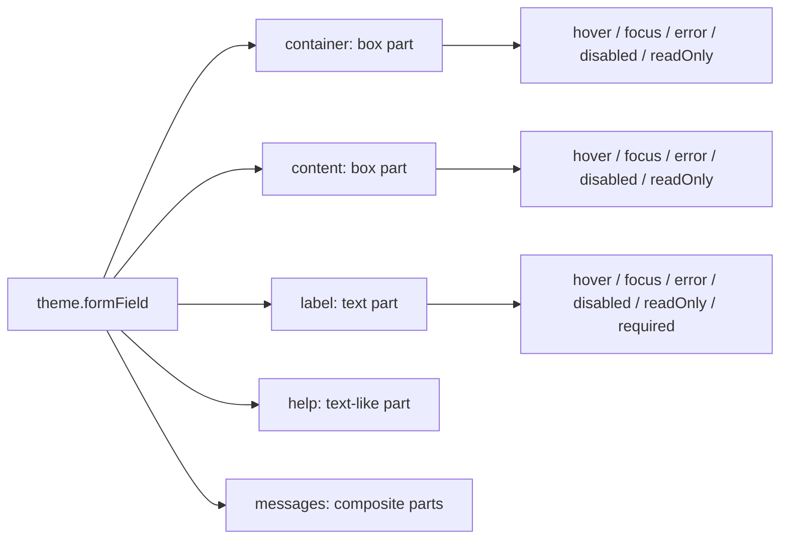

# FormField Theming: Consolidated Assessment and Recommended Direction

This assessment synthesizes [THEMING-A.md](./THEMING-A.md) and [THEMING-B.md](./THEMING-B.md), checks their observations against the current implementation and declarations, and proposes a migration path toward an explicit part-and-state theme API.

It is an architecture assessment, not an implementation specification. Statements about today's behavior are marked as current behavior; theme shapes and migration steps are proposals that require maintainer review.

## Executive summary

Both assessments reach the same central conclusion: `theme.formField` is difficult to predict because several theme keys style different rendered parts depending on `border.position`, `error` represents both a field state and a message, state-to-style paths are inconsistent, and the state resolver uses different priorities for different properties. Current types also describe a narrower contract than runtime styling accepts in some places.

A part-first model is a good direction, provided it is constrained rather than implemented as unrestricted `BoxProps` and `TextProps` bags. The proposed direction is:

- Name the field root and control frame explicitly as `container` and `content`.
- Put style states directly on their part, e.g. `content.error.border`, with a documented set of reserved state names.
- Separate message styling into `messages.error` and `messages.info`; put styles on each message's `container` and `text` subparts.
- Keep child-input visuals in each input component's own theme. FormField owns the surrounding frame and behavior handoff, not the child input's internal anatomy.
- Define per-part style allowlists and use one typed, reusable resolver for new-shape themes. Treat CSS pseudo-states and text-only CSS capabilities as explicit infrastructure, not as existing Box/Text behavior.
- Add the new API compatibly before deprecating legacy keys. Preserve legacy resolution separately during the compatibility period; today's distinct precedence chains cannot be translated losslessly into one state merge order for every combination.

Two decisions should remain open until design and compatibility expectations are reviewed: the precedence of simultaneously active states, and whether a no-border field should receive the full new state treatment. This document gives concrete alternatives rather than implying that one order preserves today's behavior.

## 1. Assessment comparison

### 1.1 Agreements

| Shared finding | Why it matters |
|---|---|
| Theme paths should identify the part they style. | `border.position` currently moves border, round, focus treatment and some backgrounds between the root and content frame. |
| FormField-owned parts differ from the child input. | The input has its own theme; FormField coordinates plain/focus handoff and styles the surrounding frame. |
| `error` is overloaded. | Message text/container/icon settings and field error-state settings share a namespace, making token ownership unclear. |
| State behavior is inconsistent. | Current state styling uses separate first-match chains and the state nesting of disabled label/help/info does not match the other tokens. |
| Box/Text vocabularies need constraints. | Structural, event, accessibility and layout props can affect FormField behavior if arbitrary component props are spread as theme styles. |
| Compatibility should be incremental. | New theme paths can be additive first; warnings and legacy removal should happen only after a migration window. |

These observations are confirmed by [FormField.js](./FormField.js), [base.js](../../themes/base.js#L1289-L1393), and [base.d.ts](../../themes/base.d.ts#L1233-L1313).

### 1.2 Strengths and limitations of the source assessments

| Assessment | Strengths | Limitations / gaps addressed in C |
|---|---|---|
| THEMING-A | Strong end-to-end anatomy and token inventory; clearly explains the three current state-resolution chains; provides a useful architecture risk analysis and phased migration plan. | Less concrete consumer evidence; leaves padding semantics and message namespace less resolved; its proposed state order is one candidate, not a behavior-preserving answer; group-item ownership and reserved state-name collisions need more discussion. |
| THEMING-B | Adds part/state goals, a detailed per-token audit, concrete HPE escape-hatch evidence, explicit `content.pad` consequences, and useful questions about group-item ownership and state-key collisions. | Some child-name/focus/padding details need source qualification; the HPE “largest consumer” characterization is unverified; its proposed priority is not the only reasonable order; a best-of-breed synthesis needs a clearer compatibility boundary between legacy and new resolution. |

Both are useful assessments, not implementation specifications. C retains A's state/anatomy clarity and migration framing, and B's consumer evidence, explicit padding issue, and ownership questions, while qualifying claims against source and leaving behavior decisions visible.

### 1.3 Differences and unique contributions

| Topic | THEMING-A | THEMING-B | Synthesis in C |
|---|---|---|---|
| HPE consumer evidence | General feasibility and migration analysis. | Checks the installed `grommet-theme-hpe@8.2.0` theme and finds per-input extensions and selectors reaching into group markup. | Retain the concrete examples as evidence of escape hatches. Do not call HPE the “largest” consumer; that comparative claim was not verified. |
| `content.pad` | Notes that runtime gates it for some child types. | Calls out the theme-author surprise and asks for explicit per-input behavior in the new API. | Make padding semantics explicit for new-shape themes; retain the legacy gate only in compatibility handling if parity requires it. |
| State naming | Places states directly beneath parts. | Also surfaces the potential collision between future style-prop names and state names. | Use direct `part.state` paths, as selected for this proposal, and reserve/document the state names for FormField theme parts. A `states` sub-object remains an alternative if the vocabulary later collides. |
| Typography | Focuses on the public Text prop vocabulary gap. | Details a theme-only resolver as an alternative to broadening Text's public API. | Prefer theme-only typography support initially; expand Text's API only with demonstrated cross-component need. |
| Required | Presents indicator-only versus a full required state. | Suggests a label-level `required` entry with indicator content and optional text styling; no frame-level state by default. | Keep required styling label-scoped. Defer a frame-level required state until a concrete design use case exists. |
| Group-item styling | Notes HPE's internal selector workaround. | Asks whether a group-item subpart belongs under FormField or grouped inputs. | Compare both ownership models in §8. Keep this an open design choice; do not expose an API that depends on private child markup without a clear owner. |

### 1.4 Source-checked corrections and qualifications

The following details should be stated precisely in future design or implementation work:

- The current focus-owner and padding child-name lists are not identical. In the implementation, `RadioButton` appears in the padding list but not the focus-exception list; the assessments' summaries do not consistently capture that difference. Consult the source rather than copying those lists into a proposed public contract.
- FileInput focus suppression is specific to the inner content-box path; outer-border mode can still put focus styling on the root. Avoid describing FileInput as universally suppressing the FormField focus treatment.
- `focus.background` is typed as a background shape, but the outer-border path reads its `color`; the inner path does not apply it as a focus background.
- `content` is spread onto the content Box at runtime, but the base theme declaration is narrower. The public FormField props separately type `contentProps` as Box props; neither fact makes every Box prop a safe theming key.
- `survey.label` replaces the normal label theme object at runtime rather than deep-merging it. The base theme uses a `weight` there that is not represented in the corresponding declaration.
- HPE's escape hatches are confirmed in the locally installed package. This supports the existence of real consumer needs, not a ranking of HPE against every other consumer.

## 2. Current anatomy and ownership

### 2.1 Parts and render order

| Part | Current renderer | Kind | Notes |
|---|---|---|---|
| `container` (root) | `FormFieldBox`, a styled `Box` | Box | Always rendered; receives root props and handlers; owns border in outer mode. |
| `label` | `Text as="label"` | Text | Rendered when applicable; CheckBox may render its own label instead. |
| required indicator | Required text plus screen-reader-only text | Text/content | Present when required and configured; inherits label styling today. |
| `help` | `Message`, rendering `Text` for string content or `Box` for a node | Text-like/composite | Appears between label and control frame. |
| `content` (control frame) | `FormFieldContentBox` when a FormField border is set; otherwise `StyledContentsBox` | Box | Wraps the input; owns border in inner mode. |
| child input | Consumer child or internal input fallback | External component | Own component theme controls its visual anatomy. FormField may inject behavior/presentation props. |
| error message | `Message` with optional container, icon and text | Composite | Appears after the control; shares legacy theme namespace with error state. |
| info message | `Message` with optional container, icon and text | Composite | Appears after the control. |

The stable order is label, help, content/input, error, info. Theme tokens do not currently reorder those pieces. See [Message](./FormField.js#L190-L239) and the render path in [FormField.js](./FormField.js#L790-L850).

### 2.2 FormField and input boundary

The child input should not become a FormField theme part in the sense of re-styling its internal elements. FormField currently coordinates a boundary:

- When a FormField border is present, eligible Grommet inputs may receive `plain` and `focusIndicator` so the frame and input do not draw duplicate borders or focus rings.
- `containerFocus` chooses whether the FormField or child owns the focus ring. It is behavioral configuration, not a style prop.
- FormField can inject error-related ARIA attributes such as `aria-describedby` and `aria-invalid`.
- `readOnly` is inferred for a limited set of child components/props rather than being a universal FormField state detector.
- FileInput borrows selected border settings; focus handling differs between inner and outer border placement.
- Child type affects padding handling. The current `content.pad` can be removed for input types that do not want content padding unless a `pad` prop is supplied.

These behaviors are useful context for the new theme design, but the proposal should avoid turning incidental child-name detection into a broad promise about arbitrary children. Details are in [FormField.js](./FormField.js#L278-L312), [FormField.js](./FormField.js#L377-L408), [FormField.js](./FormField.js#L509-L555), and [FormField.js](./FormField.js#L637-L766).

## 3. Current theme audit

| Legacy key | Current target | Gap or ambiguity |
|---|---|---|
| `margin`, `extend` | Root container | Clear target, though root `extend` is also used as an escape hatch for child markup. |
| `border`, `round` | Root or content, selected by `border.position` | The key alone does not identify the anatomical target. |
| `border.error.color` and `error.border.color` | Border owner in error state | Duplicate sources for error border color; compatibility logic selects between them. |
| `content` | Control frame | Runtime accepts a wider spread than the base theme declaration suggests; `pad` is gated by child type/props. |
| `label`, `help` | Label and help | Mostly part-shaped, but help nodes may render as Box rather than Text. |
| `error.color/margin/container/icon` | Error message | Mixed into the same object as field error-state styling. |
| `error.background`, `error.border` | Field in error state | Also travels through the message theme path, which can leak state-oriented props to node message content. |
| `info` | Info message | Composite shape is implicit: message container, icon and text props share a namespace. |
| `hover.*`, `focus.*`, `disabled.*` | Different combinations of root, frame, label, help and info | Some states style only selected CSS properties; `disabled.label/help/info` use state→part nesting while other paths differ. |
| `global.input.readOnly.*` | Frame/border owner | FormField readOnly styling is not consistently expressed under `formField`. |
| `[inputName].*` | Mostly content/frame behavior | Per-input overrides do not use one uniform part tree. |
| `survey.label` | Label | Replaces the base label theme object rather than merging it. |

The type/runtime mismatches are not an argument for accepting every component prop in a new theme API. They are a reason to define and test the supported theme vocabulary explicitly. See [FormField/index.d.ts](./FormField/index.d.ts#L1-L20), [base.d.ts](../../themes/base.d.ts#L1233-L1313), [Text/index.d.ts](../Text/index.d.ts#L18-L57), and [Box/index.d.ts](../Box/index.d.ts#L27-L86).

## 4. Current state behavior and its consequences

### 4.1 Current state sources and precedence

| Behavior | Current source/priority |
|---|---|
| `hover` | CSS `:hover`, enabled only when the field is not disabled, readOnly, in error, or focused. |
| Border color | First match: disabled → readOnly → error → focus → base. |
| Inner content background | First match: readOnly → error → disabled → base. |
| Outer root background | First match: error → focus → disabled → base. |
| Focus ring | Global focus styling on the selected focus owner; separate from the border color. |
| `focus-within` | Special handling for TimeInput on the content path. |
| `required` | Required indicator/label behavior, not a general state on the frame. |

Current implementation anchors: [hover gating](./FormField.js#L553-L555), [border color](./FormField.js#L570-L604), [inner background](./FormField.js#L515-L524), and [outer background](./FormField.js#L709-L730).

These chains are property-specific, not one coherent priority. For example, disabled+error can produce a disabled border but an error inner background. A single merge order necessarily changes some combined-state results unless the new model preserves separate property behavior—which would undercut the goal of one resolver.

### 4.2 Border placement changes the styled part

| Legacy mode | Root container | Content frame |
|---|---|---|
| `border.position: 'inner'` (base default) | Margin, root extension | Border, round, focus treatment, state background; hover border/background behavior. |
| `border.position: 'outer'` | Border, round, focus treatment, state background and abut margin behavior | Content styling and hover background; selected input-specific extension. |
| No `formField.border` | Root margin/extension | Content props and a reduced styling path; current implementation does not provide the same complete focus/border handoff. |

This is why the proposal names `container` and `content` independently. Whether no-border mode should still receive all new state treatments is a design/API decision, not something to assume from the existing branches.

## 5. Proposed part/state architecture

### 5.1 Goals and constraints

The model should make the path say what it styles, allow each part's states to use a suitable visual vocabulary, and specify how variants combine. It should not expose arbitrary behavior or layout props through theme objects.



`hover`, `focus`, `error`, `disabled`, `readOnly`, and (for the label) `required` are reserved names in this API. Direct `part.state` paths are the selected shape for clarity and brevity. If future Box/Text vocabulary adds a colliding property, the theme contract should resolve the collision deliberately; a `part.states.stateName` form remains a possible escape from such a collision.

### 5.2 Illustrative shape

This is an example of the intended organization, not a finalized type contract. The accepted properties should be allowlisted by part and validated through the theme types.

```js
formField: {
  container: {
    margin: { bottom: 'small' },
    extend: undefined,
    focus: {},
    error: {},
    disabled: {},
    readOnly: {},
  },

  label: {
    margin: { vertical: 'xsmall', horizontal: 'small' },
    size: 'medium',
    required: {
      indicator: true, // true, string, node, or omitted
      weight: 600,     // optional label text style while required
    },
    disabled: { color: 'text-weak' },
  },

  help: {
    color: 'dark-2',
    margin: { start: 'small' },
    disabled: {},
  },

  content: {
    pad: 'small',
    border: { side: 'bottom', color: 'border' },
    round: undefined,
    containerFocus: true, // behavior, not a Box style
    hover: {},
    focus: {},
    error: { border: { color: 'status-critical' } },
    disabled: { background: { color: 'status-disabled', opacity: 'medium' } },
    readOnly: {},
  },

  messages: {
    error: {
      container: { gap: 'small' },
      icon: undefined,
      text: { color: 'status-critical', margin: { vertical: 'xsmall', horizontal: 'small' } },
    },
    info: {
      container: {},
      icon: undefined,
      text: {
        color: 'text-xweak',
        disabled: { color: 'text-weak' },
      },
    },
  },

  kinds: {
    survey: { label: { margin: { bottom: 'xsmall' }, size: 'medium', weight: 400 } },
  },
  inputs: {
    checkBoxGroup: { content: { error: { border: { color: 'status-critical' } } } },
    textInput: { content: { hover: {} } },
  },
},
```

For composite messages, the state belongs on the actual styled subpart: e.g. `messages.info.text.disabled` for disabled info text or `messages.error.container.focus` if a visual requirement justifies it. Message-state support should be limited to real use cases; a uniform path must not imply states that the component cannot meaningfully detect or render.

### 5.3 Allowed style vocabulary

Do not spread all `BoxProps` or `TextProps` from a theme object. Define small, documented allowlists appropriate to each part.

| Part kind | Candidate visual properties | Exclude from theme style bags |
|---|---|---|
| Box (`container`, `content`, message container) | `background`, `border`, `round`, `pad`, `margin`, `elevation`, `width`, `height`, and carefully scoped `gap`/`extend` | Structural layout (`direction`, `fill`, `flex`, `basis`, `wrap`, `justify`, `align*`), tag changes, IDs, event handlers, accessibility props, and unrelated responsive/layout behavior. |
| Text (`label`, `help`, message text) | `color`, `size`, `weight`, `margin`, `textAlign`, `wordBreak`, `extend` | Tag/behavior props and generally `truncate`, especially for error/help content where hiding information is risky. |
| Resolver-backed typography | Consider `family`, `lineHeight`, `maxWidth`, `letterSpacing` as theme-only style keys | Do not imply these are currently public `Text` props. |
| Named behavior/content | `containerFocus`, required `indicator`, message `icon` | Keep out of generic style-prop translation. |

Allowlist size and exact property support should be validated against actual Grommet style helpers and responsive/dark-light value behavior. The current `Text` API does not expose all the typography fields listed in the conceptual target model.

### 5.4 State resolution choices

A single ordered deep merge is attractive, but the two source assessments recommend different relative priorities for `error` and `readOnly`. Neither choice exactly preserves every current chain.

| Candidate merge order, low → high | Resulting priority | Compatibility/semantics |
|---|---|---|
| `hover → focus → error → readOnly → disabled` | disabled > readOnly > error > focus > hover | Close to current border and inner-background ordering for readOnly/error; consistently gives disabled the final word. This is THEMING-A's candidate. |
| `hover → focus → readOnly → error → disabled` | disabled > error > readOnly > focus > hover | Makes validation error override readOnly; keeps disabled final. This is THEMING-B's candidate. |

Both candidates change some combinations, including disabled+error backgrounds relative to the current inner path. Outer backgrounds also currently use a distinct order. The team should decide whether error visibility or read-only semantics win when both are active, and document the resulting rules. The migration adapter should not silently route legacy themes through the selected new merge order if that breaks their existing per-property output.

Recommended mechanics once priority is chosen:

1. Merge base part styles, then kind overrides, then input overrides.
2. Merge active application/interaction states in the documented order; deep-merge plain objects, replace arrays/scalars.
3. Emit pseudo-class styles such as hover separately under CSS selectors, retaining current hover suppression unless UX/design explicitly changes it.
4. Keep the global focus ring and `containerFocus` behavior distinct from a focus-state border/background; state styling layers with, rather than replaces, the ring.
5. Define whether states apply in no-border mode and whether focus targets root or content independently of legacy border placement.

A generic deep-merge utility should be introduced only if its object/array/scalar semantics and memoization needs are clear. Avoid premature cache complexity; measure before adding per-render memoization machinery.

## 6. Infrastructure and tradeoffs

### 6.1 Pseudo-states are CSS, not ordinary props

Hover and `:focus-within` are selector states. A theme state object cannot simply be spread onto a React element and produce styles under `&:hover`. Existing helpers cover parts of Box style generation, but a reusable, selector-scoped props-to-CSS translator has not been verified as an existing utility.

A future resolver must account for border, background, edge/padding, round, theme color resolution, responsive/dark-light values, and `extend` semantics. It should have parity tests against the existing Box styling pipeline before reuse by FormField or other components. Tracking hover in React state is not the preferred default: it introduces rerenders and can behave poorly on touch devices.

### 6.2 Text states and node messages

Some help/message content is a React node and renders as Box rather than Text. Text-state styling therefore needs to apply as inherited CSS or to an explicit text wrapper, not depend on every child being a `Text`. A theme-only typography resolver is the smaller initial API change; adding new public `Text` props can be considered separately if broader demand is established.

### 6.3 Group input internals: two ownership models

The installed HPE theme demonstrates selectors reaching into grouped input markup (including an internal `ContentBox` class) for group-item hover/border/padding behavior. That is evidence of a capability gap, but not yet proof that FormField should own group-item styling.

| Option | Benefits | Risks |
|---|---|---|
| Grouped inputs own their items (recommended default) | Keeps component anatomy and interaction states with CheckBoxGroup/RadioButtonGroup; avoids FormField depending on child DOM/class names; input themes remain composable outside FormField. | Requires improving the grouped component theme APIs where a genuine gap exists. |
| FormField exposes a group-item subpart | Gives a single place to style the visible field group and might replace common FormField-level workarounds. | Couples FormField to particular child internals, complicates input-specific applicability and ownership, and risks standardizing an implementation detail. |

Recommendation: leave group-item ownership open for design review, with a bias toward the grouped input component's own theme. Do not add a FormField group-item part solely to reproduce HPE's private-class selector. If a supported cross-component group-frame contract emerges, specify it before adding the part.

## 7. Migration and compatibility

### 7.1 Legacy-to-proposed mapping

| Legacy theme key | Proposed destination | Migration note |
|---|---|---|
| `margin`, root `extend` | `container.margin`, `container.extend` | Keep root concerns on the root. A root extension that styles descendants should be reviewed, not mechanically moved. |
| `border.*`, `round` | Explicitly `content.*` or `container.*` | Resolve the old target using `border.position` only in the legacy adapter. New themes choose the part directly. |
| `border.error.color`, `error.border.color` | `content.error.border.color` or `container.error.border.color` | Destination depends on the intended explicit owner; consolidate duplicate sources. |
| `content.*` | `content.*` | Type only allowlisted visual props. Decide padding per new-shape input variant; preserve old gating only for legacy themes if needed. |
| `label.*`, `help.*` | `label.*`, `help.*` | Add state styles directly under the text part as needed. |
| `error.color/margin/container/icon` | `messages.error.text/container/icon` | Separate message presentation from field error state. |
| `info.*` | `messages.info.text/container/icon` | Make composite structure explicit. |
| `hover`, `focus`, `disabled` field styles | `container.<state>` and/or `content.<state>` | The destination should follow the intended visual part, not infer a global owner in new themes. |
| `disabled.label/help/info` | `label.disabled`, `help.disabled`, `messages.info.text.disabled` | Move state under the styled part. |
| `global.input.readOnly.*` used by FormField | `content.readOnly.*` and/or `container.readOnly.*` | During migration retain global fallback; precedence with explicit FormField values must be specified. |
| `[inputName].*` top-level overrides | `inputs.<inputName>.<part>...` | Keep the scope to FormField-owned parts; do not override child input internals here. |
| `survey.*` top-level variant | `kinds.survey.*` | Deep-merge partial overrides rather than replacing the base part. |
| `focus.containerFocus` | `content.containerFocus` (or documented behavior location) | Named behavior flag, not a style prop. |
| `checkBox.pad` | Keep as a child behavior/input handoff or normalize under the documented input variant | This styles the child input, not the FormField frame; decide whether it belongs in this namespace at all. |

### 7.2 Phases

| Phase | Scope | Main risk/control |
|---|---|---|
| 0 — specify and baseline | Finalize part list, allowlists, state priority, no-border behavior, and legacy style snapshots for base/custom themes. | Do not implement a resolver while these contracts are ambiguous. |
| 1 — additive API | Accept new `container`, `content`, `messages`, `kinds`, and `inputs` shapes; add declarations and targeted tests. Keep legacy resolution intact when only legacy keys are present. | Define deterministic precedence when old and new keys coexist; prefer new explicit keys, with warnings or docs. |
| 2 — state/CSS support | Add selector-scoped style generation and theme-only typography support only for justified keys. Verify responsive, dark/light, and extend behavior. | Maintain parity with existing Box styling and CSS specificity. |
| 3 — defaults and deprecation | Move base theme defaults to new paths, add migration guidance and development warnings for deprecated legacy keys. | Downstream themes may see warnings; keep adapter support through a release window. |
| 4 — breaking removal | Remove legacy adapter, `border.position` ownership branching, and old error-border compatibility after a major-release migration period. | High downstream compatibility impact; provide release notes and migration examples. |

Important compatibility limit: because the legacy implementation has separate state priorities by property and placement, a single new merge order cannot promise exact behavior for every simultaneous-state case. During additive phases, either preserve legacy behavior for legacy-only themes or document and test the cases that intentionally change. Do not claim general parity based only on matching isolated states.

## 8. Test and documentation strategy

### 8.1 Behavior tests

- Test each styled part and supported state with a custom theme, including string and node-based help/message content.
- Test combined states explicitly: disabled+error, readOnly+error, focus+error, and any combination selected by the final precedence policy.
- Test inner, outer and no-border modes separately; verify focus owner, border/round owner, hover suppression and content background.
- Verify legacy base/custom themes against captured styles before and after introducing the adapter. Include themes with omitted optional nested objects to expose unsafe assumptions.
- Add HPE-shaped theme regression cases for per-input error styling and group-item customization needs, without making HPE package behavior part of FormField's public contract.
- Check ARIA error linkage and accessibility for visible messages, required indicators, keyboard focus and focus-ring visibility.

### 8.2 Stories and guide

Add a `CustomThemed/PartsAndStates` example showing the new part paths, representative combinations, required indicator, and message subparts. Retain a legacy-shaped custom theme during the deprecation period and clearly label it. Publish a migration table and describe the chosen state order and no-border behavior in the component documentation/release notes.

## 9. Decisions to settle before implementation

1. **State precedence:** should readOnly or error win when both are active? Which state should control background, border and text? Choose one documented merge order and state the behavior changes from today's separate chains.
2. **No-border behavior:** should content/container receive the full new states and focus treatment when `formField.border` is absent, or should the no-border mode remain intentionally reduced?
3. **Group-item ownership:** should grouped input components close their own theme gap, or is a supported FormField-level group subpart necessary? Prefer input ownership unless a cross-component contract is established.
4. **Hover:** preserve suppression under focus/error/readOnly/disabled, or allow hover styling to layer independently? Keep CSS-based hover unless there is a compelling reason to track pointer state in React.
5. **Focus visibility:** does the new API need a `focus-visible` distinction beyond the global focus ring and existing focus ownership behavior?
6. **Typography scope:** begin with a theme-only resolver for demonstrated needs, or expand the public Text API later based on wider component demand?
7. **Padding and child variants:** what is the explicit default for each input kind, and does `checkBox.pad` remain a FormField handoff or move to the child's own theme?
8. **Legacy/new coexistence:** when a theme specifies both shapes, does the new part path always win, and how long is the adapter supported?

## 10. Overall assessment

The architecture is feasible and has meaningful upside: theme keys can identify their targets, message styling no longer shares the error-state namespace, variants can become consistent, and current consumer escape hatches can be evaluated as explicit API gaps. The work is medium in scope rather than trivial: it includes type design, compatibility semantics, selector-scoped CSS generation, tests for state combinations, and a maintained migration window.

The safest sequence is to settle the open behavior decisions first, baseline current output, then add the new API with a separate legacy adapter. The most important restraint is to preserve ownership boundaries: expose style only for FormField's actual parts, keep child input anatomy with child components, and add new style capabilities only when a concrete consumer need and testable contract justify them.
